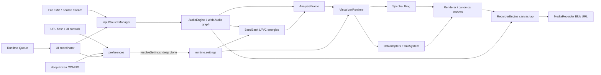

# Codebase Audit

**Project:** Auralprint
**Generation timestamp:** 2026-10-05 00:48:35 UTC
**Audited revision:** `2332f9b` on branch `work` (working tree already contained platform-specific `node_modules` changes before the audit)
**Finding count:** 0 Critical, 2 High, 7 Medium, 5 Low, 4 Informational

## 1. Executive Summary

Auralprint is an offline-first, browser-only audio player/analyzer and canvas visualizer. Its development form is a set of ES modules and CSS files, but its release artifact is a single HTML file assembled by esbuild plus a small Python inliner. At runtime a global application coordinator constructs one Web Audio graph, derives L/R/C time- and frequency-domain analysis, projects that data through a reusable `AnalysisFrame`, and dispatches an ordered Spectral Ring plus zero or more Orb visualizers. URL hashes persist configuration; queue, source, recording, and simulation history are process-local.

The implementation has several genuinely good seams: immutable canonical configuration, normalized Orb definitions, ID-based visualizer reconciliation, source-activation cancellation tokens, and explicit recording taps. The 145 Node tests passed, and the standalone build completed. Those facts do not establish browser correctness: most tests replace the DOM, Web Audio, media capture, and MediaRecorder with small fakes, and the repository has no CI configuration or end-to-end browser suite.

The highest correctness defect is a configuration-order bug. URL preset sanitation updates `runtime.settings` before `UI.applyPrefs()` snapshots the previous band definition, so a runtime hash change involving count/floor/ceiling/distribution is incorrectly judged unchanged and the frequency bank is not rebuilt (AUD-001). The highest availability risk is the combination of unbounded Orb collection size, a user-controlled/unbounded frame-delta cap, very large per-Orb particle lifetimes/rates, and overlap scans. A crafted preset can turn one navigation into extreme CPU, memory, and DOM work (AUD-002).

Other material issues include accepting a floor above Nyquist, overlapping FFT-bin ownership, inaccurate waveform downsampling, a conditional concurrent file-load race, unbounded in-memory recording chunks, and a non-reproducible repository layout that tracks `node_modules` while ignoring nothing. No direct credential, authorization, server-side injection, or remote data-exfiltration surface exists in the reviewed code. The meaningful security boundary is instead local availability: hashes, files, captured streams, and browser media APIs feed expensive client-side operations.

Major intervention is **not** warranted as a rewrite. The recommended response is targeted: establish hard resource/configuration limits and a single settings-application transaction, add real browser integration coverage around audio/source/recording behavior, then address numeric analysis and packaging reproducibility.

## 2. Audit Scope and Method

Implementation was treated as authoritative. README, roadmap, comments, `agents.md`, and tests were used as claims and compared with traced behavior rather than assumed correct.

Inspected areas:

- every tracked application module under `src/js`, the HTML template, CSS ownership, build/watch/inlining scripts, package manifests/lockfile, repository history/status, historical canon bundles, and all test files;
- startup and animation, Web Audio graph construction, source switching and cancellation, file/queue lifecycle, waveform decode/seek, L/R/C analysis, band rebuilding, preset migration, Orb normalization/reconciliation, visualizer update/render/reset, recording acquisition/finalization, workspace/UI refresh, and packaging;
- success and failure paths for file playback, permission requests, source teardown, MediaRecorder setup/stop, invalid presets, and stale asynchronous work.

Commands executed (representative):

```text
find .. -name AGENTS.md -print
find . -path './.git' -prune -o -path './node_modules' -prune -o -type f ...
git status --short --branch
git ls-files ... | xargs wc -l
rg -n '^import|...' src scripts tests
rg -n 'catch|TODO|addEventListener|createObjectURL|...' src/js
node -e "import('./src/js/core/config.js')..."
npm test
npm run build
npm audit --omit=dev
git check-ignore -v docs/foo.md
```

Limitations:

- No browser automation framework or browser binary is declared, so canvas output, Web Audio channel behavior, autoplay policies, touch/pointer interaction, accessibility tree, permission prompts, captureStream, and actual MediaRecorder containers were not exercised.
- No representative media corpus, corrupt/large files, physical microphone, display-capture source, constrained hardware, or long-duration recording session was supplied.
- Historical standalone files in `docs/Canon` were inventoried and sampled as release evidence, not line-by-line re-audited as independent current implementations; current source and current build scripts are authoritative.
- Network deployment does not exist in the repository. Hosting headers, CSP, origin isolation, HTTPS, cache policy, and release publication cannot be assessed here.
- Build/test commands mutated already-tracked platform-specific `node_modules` files; those changes were present at initial status and are excluded from this audit commit. Generated `.build/` and `dist/` are investigative artifacts, not report changes.

## 3. Reconstructed Architecture



### Entry and initialization

`src/js/main.js :: main()` caches the canvas, resolves defaults, applies the URL hash, resolves again, initializes source capability state, builds the pre-context BandBank, creates runtime Orbs/visualizers, initializes recording with renderer/audio tap functions, wires UI, and schedules `requestAnimationFrame`.

### Runtime loop

Each animation frame resizes the canonical canvas, clamps elapsed time, samples Web Audio, mutates a reusable `AnalysisFrame`, updates all visualizers, clears/renders the scene, refreshes UI text, and redraws the scrubber. `VisualizerRuntime` owns composition order: Spectral Ring first, then Orbs in `runtime.settings.orbs` order.

### State ownership

- `CONFIG`: recursively frozen canonical defaults/limits.
- `preferences`: mutable persistent configuration object.
- `runtime.settings`: whole-object deep clone produced by `resolveSettings()`.
- `state`: mutable session data (canvas, audio/source/recording, band arrays, runtime Orbs, UI state).
- Queue and AudioEngine internals: closure-local mutable singletons.
- Visualizer ephemeral state: Orb instances/trails and `state.bands.ringPhaseRad`.

This is not strict dependency injection: many modules import and mutate the `runtime` and `state` singletons directly. The explicit seams (`AnalysisFrame`, recording taps, source manager factory) coexist with global state.

### External boundaries

Inputs are URL hashes, user-selected/dropped `File` objects, MediaDevices streams, browser media events, form values, and timing. Outputs are canvas pixels, speaker audio, URL hashes/clipboard writes, status DOM, and Blob download URLs. There is no application network client, backend, database, service worker, or persistent local storage.

## 4. Repository / Component Inventory

| Component | Actual role |
|---|---|
| `src/js/core` | Frozen config, mutable preference/runtime/state singletons, generic utilities, coordinate conversion, and Orb collection normalization. |
| `src/js/audio` | Web Audio graph and transport, source session lifecycle, queue, waveform decode/scrubber, L/R/C band analysis, and reusable consumer frame. |
| `src/js/render` | Visualizer registry/adapters, Orb simulation, particle history, color policy, and Canvas2D drawing. |
| `src/js/recording` | Feature/support negotiation, canvas/audio stream acquisition, MediaRecorder lifecycle, in-memory chunk assembly, and Blob URL ownership. |
| `src/js/presets` | Base64url hash encoding, schemas 2–10 migration, sanitation, and replacement of persistent preferences. |
| `src/js/ui` | One 1,797-line coordinator plus extracted panel/editor modules and DOM cache. Owns queue/source/transport orchestration and virtually all listeners. |
| `src/index.template.html`, `src/css` | Complete application shell and bundled styles; no framework or template runtime. |
| `scripts` | esbuild JS/CSS bundles, JSON metafile, watch serialization, and Python single-file assembly. |
| `tests` | Node built-in test runner with hand-built DOM/Web API fakes; 145 cases, heavily concentrated in `targeted-audit.test.js`. |
| `docs/Canon` | Historical, large single-file release artifacts and changelog; not consumed by the current build. |
| `node_modules` | Unexpectedly tracked partial dependency installation; changes by platform/install. See AUD-007. |

No CI/CD, Docker, database, migrations, server API, plugin loader, service worker, or deployment manifest exists at the audited revision.

## 5. Runtime and Data-Flow Analysis

### File playback and queue

UI operations first mutate the closure-owned Queue cursor, then call `loadAndPlay()`. It increments a request ID, resets trails/scrubber/dominant band, delegates to `InputSourceManager.activateFile()`, then to `AudioEngine.loadFile()`. AudioEngine creates an `<audio>` element/Object URL, installs abortable listeners, tears down the previous graph, creates a MediaElementSource, and connects playback plus analysis branches. A successful return starts asynchronous independent waveform decoding. Natural `ended` invokes one hook implementing repeat/advance.

### Live inputs

Mic/display activation invalidates older requests, requests a MediaStream, requires at least one audio track, attaches it without local monitoring, registers track/inactive listeners, and records a session. Cancellation tokens stop late streams. Teardown removes listeners, stops tracks, unloads AudioEngine, and resets source state.

### Analysis

One ChannelSplitter feeds L/R analysers and two 0.5-gain nodes feed a center analyser. Every ready frame reads three waveform/frequency buffers, computes RMS/correlation, dynamically changes center weights when one side is silent, and averages normalized dB bins into BandBank arrays. `AnalysisFrame` publishes producer-owned references. The architecture avoids copies but relies on a read-only convention that JavaScript cannot enforce.

### Presets/configuration

Preset decode parses an entire hash, starts from defaults, clamps most fields, migrates legacy global Orb behavior, normalizes IDs/Orb structures, replaces `preferences`, and immediately resolves `runtime.settings`. UI then normally applies preferences again, synchronizes runtime Orbs, conditionally rebuilds bands, and pushes live analyser/playback values. The duplicated resolve step creates AUD-001.

### Rendering

Orb update maps selected channel/bands to energy, integrates phase, samples waveform displacement, computes position/color, expires particles, and emits new ones. Rendering allocates a ring point array and per-trace particle slice, then draws into the canonical canvas. Recording passively captures that canvas and either an AudioEngine destination stream or the active upstream live stream.

### Recording

Start validates support/source, captures the canvas, optionally acquires audio, creates a merged MediaStream, and stores every MediaRecorder chunk. Stop enters `finalizing`; `onstop` joins all chunks into one Blob, creates a retained Object URL, releases streams/taps, and exposes download metadata. Reset/dispose revoke retained exports; a later export revokes its predecessor.

## 6. Findings Summary

| ID | Severity | Confidence | Area | Finding |
|---|---|---|---|---|
| AUD-001 | High | Confirmed | Configuration/analysis | Runtime URL presets can change band settings without rebuilding band definitions. |
| AUD-002 | High | Confirmed | Availability/performance | Crafted presets can create unbounded visualizer/particle work and extreme DOM/memory pressure. |
| AUD-003 | Medium | Confirmed | Validation/correctness | Presets accept frequency floors above Nyquist and publish misleading effective metadata. |
| AUD-004 | Medium | Confirmed | Analysis correctness | Adjacent bands double-count shared FFT bins; narrow/top bands can collapse onto identical bins. |
| AUD-005 | Medium | Confirmed | Scrubber correctness | Waveform bucket construction drops tail samples and mis-scales short buffers. |
| AUD-006 | Medium | Conditional | Concurrency | File-load currency is checked around, but not atomically with, graph replacement. |
| AUD-007 | Medium | Confirmed | Build/dependencies | `node_modules` is tracked, no `.gitignore` exists, and install/build dirties the tree platform-dependently. |
| AUD-008 | Medium | Confirmed | Delivery/testing | No CI exists to enforce the documented sequential test/build gates. |
| AUD-009 | Medium | Confirmed | Recording/resources | Recording retains every chunk plus final Blob in memory with no duration/size backpressure. |
| AUD-010 | Low | Confirmed | Error handling | Several boundary callbacks swallow exceptions without preserving actionable diagnostics. |
| AUD-011 | Low | Confirmed | Presets/operability | Invalid URL presets fail silently and are indistinguishable to callers by cause. |
| AUD-012 | Low | Confirmed | Rendering performance | Avoidable per-frame allocations and unconditional UI refreshes add sustained GC/DOM cost. |
| AUD-013 | Low | Confirmed | Migration/data contract | Duplicate band names make legacy name-to-index migration ambiguous and lossy. |
| AUD-014 | Low | Confirmed | Documentation | Current roadmap prose contains stale and internally contradictory stage claims. |
| AUD-015 | Informational | Confirmed | Architecture | Global singleton state remains the dominant coupling mechanism despite newer explicit seams. |
| AUD-016 | Informational | Confirmed | Security/deployment | Single-file inline assets require permissive CSP unless deployment supplies hashes/nonces. |
| AUD-017 | Informational | Strong inference | Dead/obsolete | Recorder `onAnimationFrame()` is a retained no-op compatibility seam with no current caller. |
| AUD-018 | Informational | Confirmed | Tests | Tests prove many model contracts but do not exercise real browser/media integration. |

## 7. Detailed Findings

### AUD-001 — Runtime URL preset band changes do not rebuild BandBank

**Severity:** High
**Confidence:** Confirmed
**Area:** Configuration, analysis correctness
**Affected code:** `src/js/presets/url-preset.js :: sanitizeAndApply()`; `src/js/ui/ui.js :: applyUrlNow(), hashchange handler, applyPrefs()`

**Finding**

`sanitizeAndApply()` replaces preferences **and calls `resolveSettings()`**. Both runtime URL paths then call `applyPrefs({ rebuildBandsOnDefinitionChange: true })`. `applyPrefs()` obtains `prevBandDefKey` from `runtime.settings`, but runtime already contains the incoming definition. It resolves the same values again and concludes no definition changed, so `BandBankController.rebuildNow()` is skipped.

**Evidence**

The preset path resolves at `url-preset.js` lines 207–209. `applyPrefs()` snapshots at `ui.js` line 398, resolves at 402, compares at 406, and rebuilds only if the comparison differs at 407–409. `applyUrlNow()` and `hashchange` use exactly this sequence. At boot the later unconditional `BandBankController.rebuildNow()` masks the defect; it is exposed only after startup.

**Impact**

The UI/runtime settings can report a new count, floor, ceiling, or distribution while `state.bands.lowHz/highHz` and energy arrays still represent the old definition. Consumers then combine new counts with old boundaries. Count increases can read undefined boundaries and produce NaN bin calculations; count decreases leaves stale arrays/metadata. The primary analyzer and visualizers are therefore incorrect until another legitimate rebuild or reload.

**Trigger / Conditions**

Apply a valid hash, navigate to a different preset hash, or use the Apply URL action after the AudioContext/band bank has already initialized, where any band-definition field differs.

**Root Cause**

Settings application is split between the preset decoder and UI coordinator. Both mutate the derived runtime layer, destroying the “before” value required by change detection.

**Recommendation**

Make preset sanitation return/replace only canonical preferences and perform derived resolution, diffing, band rebuild, Orb synchronization, and live setting updates in one transaction. Add an integration regression that initializes a known bank, applies a different URL definition through the real UI orchestration, and asserts boundaries, lengths, metadata, and analyser arrays change together.

**Related Findings:** AUD-003, AUD-018.

### AUD-002 — Preset-controlled work is effectively unbounded

**Severity:** High
**Confidence:** Confirmed
**Area:** Availability, performance, input validation
**Affected code:** `src/js/presets/url-preset.js`; `src/js/core/orb-collection.js :: normalizeOrbCollection()`; `src/js/render/trail-system.js`; `src/js/ui/orb-editor.js`; `src/js/ui/visualizers-panel.js`

**Finding**

There is no maximum Orb count or preset payload limit. Each Orb may emit 1,000 particles/second with a 600-second TTL (up to roughly 600,000 live particles before overlap removal per Orb), and every emission scans/splices the existing particle array. `timing.maxDeltaTimeSec` accepts any finite positive value without an upper bound and controls both frame integration and the emission guard. Every Orb also creates editor/inventory DOM.

**Evidence**

`normalizeOrbCollection()` loops over the entire incoming array without a cap. Preset sanitation accepts every incoming Orb and directly accepts any positive `maxDeltaTimeSec`. Particle limits allow 1,000/s and 600s. `TrailSystem.removeOverlaps()` is linear and uses `splice`; `updateAndEmit()` expires linearly and loops up to a guard proportional to the user-controlled max delta. UI refresh builds one complex card per Orb.

**Impact**

A shared hash can freeze or crash the tab through decoding/normalization, quadratic ID repair, DOM creation, simulation, particle memory, overlap scans, and drawing. This is a client-side availability weakness, not code execution or cross-origin compromise. Normal UI-accessible maximum settings can also overwhelm modest devices without a malicious hash.

**Trigger / Conditions**

Open a crafted/persisted hash with many Orbs, extreme positive timing, and maximum particle settings, or manually configure several long-lived high-rate Orbs. Browser URL limits reduce but do not eliminate the risk; large URLs can still encode substantial collections.

**Root Cause**

Per-field sanitation is mistaken for aggregate resource governance. No scene-wide particle budget, collection cap, payload cap, or complexity-aware limit exists.

**Recommendation**

Define explicit maximum encoded payload, Orb count, per-Orb live particles, scene-wide particles, and timing bounds. Use predictable eviction or emission throttling and data structures that avoid full-array overlap scans. Reject over-budget presets before replacing live state and report the reason.

**Related Findings:** AUD-009, AUD-012.

### AUD-003 — Frequency floor can exceed Nyquist

**Severity:** Medium
**Confidence:** Confirmed
**Area:** Input validation, analysis correctness
**Affected code:** `src/js/presets/url-preset.js :: sanitizeAndApply()`; `src/js/audio/band-bank-controller.js`; `src/js/audio/band-bank.js :: rebuild()`

**Finding**

The preset accepts any finite positive floor/ceiling and only enforces `ceiling >= floor`. The controller caps the configured ceiling to Nyquist, but `BandBank.rebuild()` then calculates `f1 = max(floor, effectiveCeiling)`, restoring an above-Nyquist value. Metadata calls that value the effective ceiling.

**Impact**

Most or all bands clamp to the final FFT bin, energies become duplicated/meaningless, and displayed metadata contradicts the Nyquist invariant.

**Trigger / Conditions**

A valid schema hash with floor above half the actual AudioContext sample rate (or an unusually low-rate context).

**Root Cause**

Validation happens without sample-rate context, and the later rebuilding fallback prioritizes floor over the effective ceiling.

**Recommendation**

Define behavior when Nyquist is below the configured floor (reject, lower floor, or publish an explicitly empty/limited bank), and keep configured versus effective values distinct. Test low sample rates and hostile presets.

**Related Findings:** AUD-001, AUD-004.

### AUD-004 — FFT bins are counted in adjacent bands

**Severity:** Medium
**Confidence:** Confirmed
**Area:** Numeric correctness
**Affected code:** `src/js/audio/band-bank.js :: computeEnergiesFromAnalyser()`

**Finding**

Each band uses `floor(low)` through `ceil(high)`, inclusive. Adjacent frequency intervals therefore share their boundary bin, and may share more bins where bands are narrower than FFT resolution. When configured ceiling equals Nyquist, the last interior band and open-ended band both include the final bin.

**Impact**

Energy is not partitioned across bands; dominant-band selection is biased and neighboring visual targets respond to the same spectral samples. At 256 bands and smaller FFT sizes this is material, not merely rounding noise.

**Trigger / Conditions**

All analysis, especially dense/perceptual bands and low FFT sizes.

**Root Cause**

Frequency intervals were mapped independently rather than producing a monotonic half-open bin partition (or documented weighted filters).

**Recommendation**

Choose and document a band-energy model. For rectangular bands, derive monotonic half-open bin ranges once during rebuild and explicitly handle bands narrower than one bin. Add impulse/tone tests at boundaries and Nyquist.

### AUD-005 — Waveform peak buckets omit or misplace samples

**Severity:** Medium
**Confidence:** Confirmed
**Area:** Scrubber correctness
**Affected code:** `src/js/audio/scrubber.js :: buildWaveformPeaks()`

**Finding**

`bucketSize = floor(sampleLength / buckets)` and fixed `start = b * bucketSize` omit the remainder for ordinary buffers. If samples are fewer than buckets, bucket size becomes one: samples occupy only the first `sampleLength` buckets and all remaining buckets are zero, so the whole duration is visually compressed into the left side.

**Impact**

The displayed overview may omit a terminal transient and does not preserve time mapping for short decoded buffers. Seeking remains time-based, so the waveform and seek position can disagree.

**Trigger / Conditions**

Any non-divisible sample length; gross distortion when decoded sample length is below 512.

**Root Cause**

Buckets use constant integer width rather than proportional start/end boundaries.

**Recommendation**

For bucket `b`, use floor/ceil boundaries derived from `b * sampleLength / buckets`, and define empty-buffer behavior. Test non-divisible and shorter-than-bucket buffers including a last-sample impulse.

### AUD-006 — Graph replacement is not atomic with file-load currency checks

**Severity:** Medium
**Confidence:** Conditional
**Area:** Concurrency/asynchrony
**Affected code:** `src/js/audio/audio-engine.js :: loadFile(), attachSource()`; `src/js/ui/ui.js :: loadAndPlay()`

**Finding**

The request ID is checked after initial context resume and after playback, but `attachSource()` independently awaits `ctx.resume()` and then unconditionally tears down/replaces the graph. There is no currency check immediately before or after that mutation.

**Impact**

If two file loads interleave across context-resume/play promises in an unfavorable order, an obsolete request can tear down the newer graph. Its eventual stale return releases its element but does not reconstruct the current graph, leaving queue/source state and AudioEngine internals inconsistent.

**Trigger / Conditions**

Rapid concurrent track changes while AudioContext resume or media playback is pending, with browser promise settlement ordering that lets an older request cross the graph-mutation boundary late.

**Root Cause**

Cancellation is advisory at the outer operation; the state-changing inner operation is not token-aware or serialized.

**Recommendation**

Serialize source graph transitions or pass the request token into `attachSource()` and check it immediately before commit. Treat descriptor/resource creation as provisional until an atomic current-request commit, and clean up only resources owned by the stale request.

### AUD-007 — Dependency installation is tracked and platform-unstable

**Severity:** Medium
**Confidence:** Confirmed
**Area:** Dependencies, build reproducibility
**Affected code:** repository root, tracked `node_modules/**`, absent `.gitignore`

**Finding**

Fourteen `node_modules` paths are tracked, including Windows esbuild binaries/shims, while the Linux install changes/deletes them and adds Linux binaries. There is no `.gitignore`; build outputs `.build/` and `dist/` are also untracked only by accident, not policy.

**Impact**

Routine install/test/build operations dirty the tree, platform-specific binaries can be accidentally committed, reviews are noisy, and checkout contents can diverge from `package-lock.json` installation semantics. Release provenance is weakened.

**Trigger / Conditions**

Install or use dependencies on an OS different from the one that committed the vendor files; run the documented build.

**Root Cause**

Generated/dependency boundaries are not declared and a partial install was committed.

**Recommendation**

After deciding whether release artifacts should be versioned, remove installed dependencies from version control, add explicit ignore rules, and use `npm ci` from the lockfile in automation. If vendoring is intentional, vendor complete audited artifacts with a platform policy rather than an npm working directory.

### AUD-008 — Documented gates have no automated enforcement

**Severity:** Medium
**Confidence:** Confirmed
**Area:** CI/CD, quality assurance
**Affected code:** repository configuration; `package.json`; deleted `.github/workflows`

**Finding**

No CI/CD configuration exists. Git history shows a workflow was created and then deleted. The roadmap requires sequential test/build and browser/media/accessibility/performance acceptance, but none is enforced.

**Impact**

Broken tests, packaging, version metadata, or platform installation can merge undetected. This amplifies AUD-007 and leaves the already acknowledged browser validation gap permanently manual.

**Recommendation**

Add clean-checkout CI using the supported Node/Python matrix, run test then build sequentially, verify the expected standalone filename/markers, and add a browser smoke tier. Keep device/manual acceptance separately recorded where automation cannot represent permissions/hardware.

### AUD-009 — Recording buffers are unbounded in memory

**Severity:** Medium
**Confidence:** Confirmed
**Area:** Resource management
**Affected code:** `src/js/recording/recorder-engine.js :: start(), ondataavailable, assembleCompletedRecordingExport()`

**Finding**

Every nonempty MediaRecorder chunk is pushed into `runtime.pendingChunks` until stop. Finalization constructs a Blob over all chunks and retains that Blob/Object URL for download. There is no maximum duration, byte count, quota warning, streaming sink, or backpressure.

**Impact**

Long/high-resolution recordings can exhaust tab memory or make finalization fail after the entire capture cost has been paid. Failure cleanup cannot recover the lost recording.

**Trigger / Conditions**

Long sessions, 60 fps/high-resolution canvas, high-bitrate codecs, or memory-constrained devices.

**Root Cause**

Recording is designed as an in-memory export but exposes no operational bound for that design.

**Recommendation**

Set and communicate a duration/estimated-size budget, stop safely before exhaustion, and consider streaming/file-system sinks where supported. Test long-session thresholds and finalization failure.

**Related Findings:** AUD-002.

### AUD-010 — Boundary exceptions are swallowed

**Severity:** Low
**Confidence:** Confirmed
**Area:** Error handling/observability
**Affected code:** AudioEngine listener callback, InputSourceManager cleanup/reset callback, recorder release helpers

**Finding**

Cleanup calls appropriately use best-effort catches, but important callbacks (`_onFilePlaybackError`, external live reset) are also wrapped in empty catches. A UI/state transition failure therefore disappears while lower layers continue teardown.

**Impact**

The app can settle into partial state with no diagnostic trail, making intermittent media failures difficult to reproduce.

**Recommendation**

Keep best-effort cleanup but record callback failures through a small diagnostic/status channel, preserving original and secondary errors. Avoid allowing logging itself to alter cleanup.

### AUD-011 — Invalid presets fail without diagnostics

**Severity:** Low
**Confidence:** Confirmed
**Area:** Preset interface/operability
**Affected code:** `src/js/presets/url-preset.js :: applyFromLocationHash()`; `src/js/ui/ui.js`

**Finding**

All base64, UTF-8, JSON, shape, and schema failures collapse to `false`. Boot ignores that result; interactive apply shows only “No valid preset.”

**Impact**

Users and developers cannot distinguish truncation, unsupported schema, corruption, or a programming error. Shared configuration failures are hard to support.

**Recommendation**

Return a typed result with stable reason codes while avoiding raw sensitive payloads in logs/UI. Keep boot nonfatal but expose a recoverable warning.

### AUD-012 — The frame loop performs avoidable allocation and UI work

**Severity:** Low
**Confidence:** Confirmed
**Area:** Performance/maintainability
**Affected code:** `src/js/main.js :: onAnimationFrame()`; `src/js/render/renderer.js`; `src/js/ui/ui.js :: refreshAllUiText()`

**Finding**

Every frame allocates a Spectral Ring point array/objects, slices trail arrays, renders every live particle, calls the full UI refresh coordinator, and redraws the scrubber. Some extracted panels use reference guards, but the top-level cadence is still animation-rate rather than change/rate driven.

**Impact**

GC and DOM/property traffic consume frame budget on weak hardware, compounding the particle scaling risk. This is a measured-design gap rather than proof of unacceptable default performance.

**Recommendation**

Profile first. Reuse ring buffers/point storage, draw trace ranges without slicing, move status/control refreshes to dirty flags or documented rates, and retain animation-rate playhead/canvas work only where visible.

### AUD-013 — Legacy band-name migration is ambiguous

**Severity:** Low
**Confidence:** Confirmed
**Area:** Compatibility/data integrity
**Affected code:** `src/js/core/config.js :: bandNames`; `src/js/core/preferences.js :: BAND_NAME_TO_INDEX, sanitizeOrbBandIds()`

**Finding**

Band names are not unique (for example `Lunar Reflection` appears at indices 168 and 192). `new Map(names.map(...))` retains only the last index, so legacy `bandNames` presets silently target that last occurrence regardless of the original band.

**Impact**

Older name-based Orb targets can migrate to a different frequency band without warning. Current ID-based presets are unaffected.

**Recommendation**

Preserve a versioned legacy name mapping or reject/flag ambiguous names during migration. Add duplicate-name validation and fixtures for every historical duplicate.

### AUD-014 — Roadmap status prose is internally stale

**Severity:** Low
**Confidence:** Confirmed
**Area:** Documentation drift
**Affected code:** `ROADMAP.md`, `README.md`

**Finding**

The roadmap introduction says color ownership remains open and describes 115J as next, while later sections state 115J–115L are complete and 115M is next. README states 115L is complete. The implementation contains Analysis, Spectral Ring, and Scene ownership consistent with the later statements.

**Impact**

Maintainers can choose the wrong next milestone or misunderstand active ownership. Runtime behavior is not directly affected.

**Recommendation**

After code remediation, consolidate milestone status into one canonical table and generate/review summaries from it.

### AUD-015 — Explicit interfaces coexist with broad singleton coupling

**Severity:** Informational
**Confidence:** Confirmed
**Area:** Architecture
**Affected code:** most `src/js` modules

`AnalysisFrame`, source-manager factories, visualizer lifecycle adapters, and recorder taps are useful boundaries. Nevertheless, audio, rendering, UI, spaces, bands, and Orbs directly import mutable `state`/`runtime`. Initialization order is therefore a hidden contract and tests frequently mutate globals. Preserve the good seams; migrate ownership only when fixing concrete lifecycle/testability issues rather than performing a wholesale rewrite.

### AUD-016 — Inline release artifact constrains CSP

**Severity:** Informational
**Confidence:** Confirmed
**Area:** Security/deployment
**Affected code:** `scripts/assemble_single_file.py`, generated standalone HTML

The intended single-file artifact inlines style and script. A strict deployment CSP cannot use a simple `script-src 'self'`/`style-src 'self'`; hosting must permit inline content or provide matching hashes/nonces. No hosting configuration exists to judge whether this is mishandled. This is a deployment requirement, not an application vulnerability by itself.

### AUD-017 — Recorder animation hook is obsolete in current execution

**Severity:** Informational
**Confidence:** Strong inference
**Area:** Dead/obsolete code
**Affected code:** `src/js/recording/recorder-engine.js :: onAnimationFrame()`

The method intentionally does nothing and no current source caller invokes it. The comment labels it a compatibility seam, so removal requires checking external consumers of the module; in the bundled private application it is dead.

### AUD-018 — Node tests do not validate browser/media reality

**Severity:** Informational
**Confidence:** Confirmed
**Area:** Test suite
**Affected code:** `tests/**`

The suite contains strong unit/contract coverage for normalization, migrations, source state machines, lifecycle reconciliation, UI ownership, and build helpers. However, hand-built fake elements and media objects cannot validate Web Audio routing, actual event ordering, canvas rendering, CSS/layout, permissions, autoplay, Blob playback, codec claims, captureStream, accessibility, or long-duration resources. Several tests also assert source text/ownership declarations, so they can pass while runtime behavior regresses.

## 8. Architectural Findings

### Strengths worth preserving

- Deep-frozen CONFIG and normalization prevent accidental mutation of canonical defaults.
- `AnalysisFrame` decouples visualizers from analyser nodes and reuses buffers rather than copying per frame.
- ID-based Orb reconciliation preserves surviving simulation state and avoids slot identity.
- Source manager cancellation tokens and listener cleanup make live-input teardown substantially safer than ad hoc event wiring.
- Recorder reads explicit canvas/audio taps and does not create a second renderer or source graph.
- Visualizer lifecycle order is deterministic and zero-Orb behavior is explicitly supported.

### Structural risks

- Configuration application has multiple owners (`sanitizeAndApply`, `applyPrefs`, direct panel mutations), causing AUD-001.
- Global mutable `state` and `runtime` make ordering (`DOM cache → main canvas → preset → source → bands → Orbs → UI`) part of the effective API.
- UI remains a large application service combining source orchestration, transport, queue rendering, recording, presets, hotkeys, and status. Extracted modules help rendering/editing but do not yet own the operational workflows.
- Read-only array ownership is contractual only; any consumer can mutate analysis buffers.
- Aggregate resource invariants are absent even though individual numeric fields are clamped.

## 9. Test Suite Audit

### Genuine coverage

The 145 passing tests meaningfully exercise Orb normalization/collection identity, schema migrations and round trips, band-array replacement, AnalysisFrame routing, source state transitions/cancellation, deferred file errors, queue-related UI models, panel idempotence, recording support/start with fakes, visualizer lifecycle/reconciliation, and build/watch helper behavior.

### Important gaps

- No test follows a runtime URL hash change through `sanitizeAndApply → applyPrefs → BandBank`, allowing AUD-001.
- No aggregate resource-limit, huge payload, maximum Orb, long recording, or particle budget tests exist.
- Band tests check isolated writes but not frequency-boundary partitioning, tones, Nyquist, floor-above-Nyquist, or real AnalyserNode data.
- Scrubber tests cover mono/stereo inclusion but not proportional bucket timing/remainders.
- Audio tests use fakes and do not schedule adversarial concurrent resume/play interleavings.
- No real browser tests cover DOM/CSS/accessibility, canvas pixels, keyboard focus, touch seeking, drag/drop, media errors, permissions, or codecs.
- Build tests do not start from a clean checkout or ensure the tree stays clean.

### Misleading evidence

`targeted-audit.test.js` includes assertions that inspect source strings and ownership markup. Those are useful guardrails but prove presence/naming, not execution. Recorder and source tests use deliberately simplified stream/recorder behavior; passing them cannot establish browser lifecycle compatibility. The green suite therefore supports model-level confidence, not release acceptance.

## 10. Documentation / Implementation Drift

- `ROADMAP.md` simultaneously describes earlier stages as pending and later records them complete (AUD-014).
- `url-preset.js` header says v2/v3/v4/v5 compatible, while implementation accepts schemas 2 through 10.
- `main.js` describes the frame cap as approximately 33 ms, but preset sanitation accepts arbitrary positive values, invalidating that claim (AUD-002).
- `ui.js :: clearAudioState()` says callers must teardown before it; source-switch functions call it before `activateMic/Stream()` performs teardown. Current manager behavior subsequently tears down, so this is ordering documentation drift rather than demonstrated leakage.
- The roadmap correctly states Node tests/build are not browser acceptance; current repository evidence confirms that warning.

## 11. Dead / Obsolete / Suspicious Code

- `RecorderEngine.onAnimationFrame()` is a no-op exported compatibility seam with no in-repository caller (AUD-017, strong inference).
- `InputSourceManager.readAttemptMessage()` contains “not-yet-implemented” branches for supported mic/stream, but supported activation does not call those branches; only unsupported results use it. The error branches are currently unreachable without future call changes (strong inference).
- Historical schema constants/migration paths and `docs/Canon` are not dead merely because current code writes schema 10; they implement advertised backward compatibility/release history.
- Duplicate band names are intentional-looking content but suspicious at a migration boundary (AUD-013).
- No reflection/plugin loading was found; static reference searches are therefore relatively reliable for current source, but public module exports may still be used by external ad hoc consumers.

## 12. Security and Trust Boundaries

The app has no authentication/authorization boundary, backend, credentials, cookies, database, command execution, dynamic code evaluation, or application network requests. File names are inserted with `textContent`, not HTML, and Orb IDs are kept out of raw generated HTML identifiers. Media decoding/capture is delegated to browser APIs.

Trust boundaries:

1. **URL hash:** untrusted shareable configuration; structurally sanitized but not payload/aggregate-cost bounded (AUD-002), and errors are opaque (AUD-011).
2. **Local files:** type-filtered by browser MIME prefix in UI, but actual decode/playback remains browser validation; failure is generally contained.
3. **Mic/display streams:** permission-gated browser APIs; track lifecycle is actively cleaned up.
4. **Clipboard/history:** writes the current preset URL; no remote transmission in code.
5. **Recording download:** locally created Blob URL; old URLs are revoked on replacement/reset/dispose.

No exploitable injection was established. The primary security concern is same-tab denial of service through trusted-looking shared hashes. Deployment must also account for inline CSP (AUD-016) and HTTPS requirements for media APIs, which cannot be verified from this repository.

## 13. Performance and Resource Risks

- AUD-002 is the dominant risk: unbounded Orbs and aggregate particles plus linear overlap removal/drawing.
- AUD-009 retains complete recordings in memory.
- AUD-012 identifies persistent frame allocations/UI work.
- Audio analysis performs three full analyser reads and three 256-band reductions each ready frame. This is intentional correctness work but unmeasured on constrained devices; demand/rate reduction should be considered only after profiling so channel semantics are preserved.
- AudioContext persists for page lifetime, appropriate for a single-page app. Source nodes/listeners/Object URLs/stream tracks have explicit teardown; no confirmed leak was found there.
- Scrubber creates a throwaway OfflineAudioContext per file and relies on garbage collection; no close method exists for OfflineAudioContext, but large simultaneous decodes remain a transient memory risk controlled by tokens only after `arrayBuffer()` completes.

## 14. Dependency / Build / Deployment Findings

- Runtime has no third-party dependency; esbuild is the sole declared dev dependency.
- `npm audit --omit=dev` reported zero vulnerabilities; this says nothing about the dev dependency, browser platform codecs, or tracked binary provenance.
- JS/CSS bundle concurrently, then Python inlines them and substitutes one version marker. The assembler checks marker presence but not uniqueness beyond replacing the first instance.
- Build output is not minified and includes a metafile; this is acceptable for an internal development build but increases standalone size.
- AUD-007 prevents clean platform-independent repository operation; AUD-008 means nothing enforces a clean install/build.
- The current build succeeded and produced the expected versioned HTML, but output is not checked into the audit commit.
- There are no deployment manifests or headers, so HTTPS/media permission behavior, CSP, caching, integrity, and publication are unverified.

## 15. Risk Register

| Priority | Finding | Severity | Likelihood | Blast Radius | Recommended Action |
|---:|---|---|---|---|---|
| 1 | AUD-002 aggregate resource exhaustion | High | Medium | Entire tab/device responsiveness | Establish hard payload/scene budgets before accepting presets. |
| 2 | AUD-001 stale BandBank after hash apply | High | High for shared-preset users | Primary analysis and all visual consumers | Centralize settings transaction and add integration regression. |
| 3 | AUD-003 invalid Nyquist/floor state | Medium | Low–Medium | Entire analyzer | Define low-Nyquist behavior and validate at rebuild. |
| 4 | AUD-004 overlapping bins | Medium | High | All band energies/dominant selection | Implement a documented partition/filter model. |
| 5 | AUD-009 recording memory growth | Medium | Medium | Recording session/tab | Enforce duration/size budget and test finalization. |
| 6 | AUD-006 source graph race | Medium | Low–Medium | Playback/analysis/source state | Serialize or token-guard graph commits. |
| 7 | AUD-007 tracked dependencies | Medium | High | Every developer/build platform | Untrack installs, ignore generated paths, use clean install. |
| 8 | AUD-008 absent CI | Medium | High | Entire delivery process | Reinstate clean sequential CI plus browser smoke. |
| 9 | AUD-005 waveform mapping | Medium | Medium | Scrubber display | Use proportional buckets and regression fixtures. |
| 10 | AUD-012 frame churn | Low | High | Weak-device smoothness | Profile and eliminate confirmed hot allocations/writes. |
| 11 | AUD-013 ambiguous migration | Low | Low | Affected legacy Orb targets | Version duplicate-name migration. |
| 12 | AUD-010/AUD-011 observability | Low | Medium | Diagnosis/recovery | Preserve typed error causes and secondary callback errors. |

## 16. Recommended Remediation Order

1. **Define resource and configuration invariants first.** Decide maximum hash bytes, Orb count, timing delta, live particles, recording duration/bytes, and behavior when floor exceeds Nyquist. Without these contracts, later tests merely encode another accidental limit.
2. **Create one atomic settings-application pipeline.** Separate pure decode/sanitize from committing preferences and derived runtime/band/Orb/live-engine updates. Fix AUD-001 and enforce the new limits at this boundary.
3. **Add regression tests for the boundary before numeric changes.** Cover hostile/oversized presets, runtime URL band changes, low Nyquist, and rollback/no-partial-apply behavior.
4. **Repair analysis partitioning and waveform bucketing.** These numeric changes become safer once configuration invariants and focused expected-value tests exist.
5. **Serialize audio source commits.** Exercise intentionally controlled promise interleavings and guarantee last-request-wins ownership before modifying surrounding UI code.
6. **Bound recording and render work.** Add user-visible stop/warning behavior, particle budgets, and measured performance tests; then optimize allocations proven hot.
7. **Restore reproducible delivery.** Remove installed dependencies from tracking, add ignore policy, run clean `npm ci`, tests, build, artifact checks, and browser smoke in CI.
8. **Improve diagnostics and documentation last.** Once contracts settle, expose typed preset/callback failures, remove verified obsolete seams, and reconcile roadmap/header comments so documentation reflects the fixed implementation.

This order avoids writing broad browser tests against known-invalid state transitions and prevents numeric or performance work from being invalidated by later limit decisions.

## 17. Suggested Regression Tests

1. **Runtime preset rebuild:** initialize BandBank, apply a schema-10 hash with different count/floor/ceiling/distribution through UI orchestration, and prove array lengths, edges, metadata, analyser targets, and Orb picker ranges change atomically.
2. **Preset rollback:** malformed, unsupported, oversized, and over-budget presets must leave preferences/runtime/bands/Orbs unchanged and return a specific reason.
3. **Nyquist invariant matrix:** sample rates below/equal/above configured floor/ceiling; assert every finite edge is ordered/in range and metadata distinguishes configured/effective values.
4. **Spectral partition:** inject synthetic bin arrays and boundary tones; prove chosen bin/filter ownership, dominant selection, and top band behavior.
5. **Waveform proportionality:** non-divisible length, length below bucket count, empty buffer, multichannel tail impulse, and last-sample impulse.
6. **Concurrent source loads:** deferred context resume and play promises settled in multiple orders; prove last request owns element, graph, listeners, URL, source state, and queue status.
7. **Scene budget:** maximum accepted Orbs/particles remains bounded; one-over-limit preset fails before DOM/runtime mutation.
8. **Recording budget:** simulated chunks cross warning/hard limits; capture stops/finalizes predictably, releases tracks/taps, and keeps/revokes the correct export URL.
9. **Real browser audio:** known stereo file with distinct L/R tones; verify L/R/C analyser routing and source switches across file/mic/shared stream where permissions allow.
10. **Browser recording:** record known canvas/audio, stop, download, and inspect container tracks/duration in each supported engine rather than trusting `isTypeSupported` alone.
11. **Accessibility/layout:** keyboard-only panel recovery, generated Orb controls, live regions, narrow viewport, zoom, touch scrub, and hidden panel focus using a real accessibility tree.
12. **Clean build:** fresh checkout + `npm ci` + sequential test/build; assert only intended ignored artifacts appear and generated HTML contains one version plus inlined assets.

## 18. Open Questions / Unverified Risks

- Which browsers/versions and OSes are release targets? Real Web Audio channel splitter behavior, display audio availability, MIME support, and MediaRecorder finalization require that matrix.
- What are acceptable Orb/particle/recording limits on the weakest supported device? Representative hardware and frame/memory telemetry are required.
- Are arbitrary internet-shared preset URLs an intended trust scenario, or only self-generated local URLs? This affects prioritization, not the existence, of AUD-002.
- Is tracking `node_modules` intentional vendoring or accidental? Maintainer/release policy is required before cleanup.
- Must recordings span track changes with seamless audio? The graph attempts to reconnect the same destination, but actual MediaRecorder continuity needs browser tests.
- What semantics are intended for adjacent spectral bands: disjoint rectangular bins, weighted filters, or deliberate overlap? AUD-004 identifies undocumented current behavior; the correct replacement is a product/analysis decision.
- Are historical name-based presets known to use duplicated band labels? A corpus would quantify AUD-013 impact.
- How are standalone files hosted? HTTPS, CSP, cross-origin isolation, cache headers, and release authenticity require deployment information absent from the repository.
- No real-media, live-device, long-session, accessibility, or constrained-hardware acceptance could be completed in this environment.

## 19. Positive Findings

- Configuration is recursively frozen, and Orb normalization returns a canonical whitelist with nested copies and cross-field size/TTL constraints.
- Presets start from defaults rather than current mutable state, preventing partial older presets from accidentally inheriting unrelated live preferences.
- Live source activation explicitly stops late-granted streams and removes ended/inactive listeners on teardown.
- Audio element listeners share an AbortController; object URLs are revoked on load/error and again defensively on release.
- Analysis arrays are reused and exposed through a data-only frame rather than leaking AnalyserNodes into visualizers.
- Visualizer reconciliation preserves surviving Orb instances, phase, and trails by stable ID; zero Orbs and Spectral Ring lifecycle are tested.
- Recorder stream ownership is carefully separated: canvas/audio owners provide taps, merged streams are glue, and retained export URLs are revoked on replacement/reset/dispose.
- User-provided file names use text nodes, and generated Orb DOM identifiers are derived from internal sequence rather than raw persistent IDs, reducing injection/collision risk.
- Build assembly escapes closing script tags and fails on missing template/version markers.

## 20. Final Assessment

**Correctness:** Model/configuration code is generally disciplined, but runtime preset application and numeric band/bin edge behavior can make the primary analyzer materially wrong.
**Architectural health:** Improving. Explicit analysis, source, visualizer, and recorder seams are valuable, while global singleton mutation and split configuration ownership remain important liabilities.
**Maintainability:** Moderate. Focused modules coexist with a very large UI coordinator and implicit initialization contracts. Stable IDs and canonical normalization reduce risk.
**Robustness:** Source teardown is comparatively strong; aggregate resource limits, recording bounds, concurrency serialization, and diagnostics are not.
**Security posture:** Low traditional attack surface, no established injection/exfiltration vulnerability, but a credible client-side availability weakness through shared presets. Deployment security is unknown.
**Test reliability:** Strong for isolated contracts, insufficient for browser/media/release claims. A green Node suite is not release evidence.
**Readiness:** Suitable for continued targeted development, not yet justified as fully accepted Build 115/release-quality media software without browser/device/performance evidence.

The most important next engineering step is to define bounded configuration/resource invariants and implement a single atomic settings application transaction, with a runtime URL preset regression proving the BandBank and all consumers update together.
