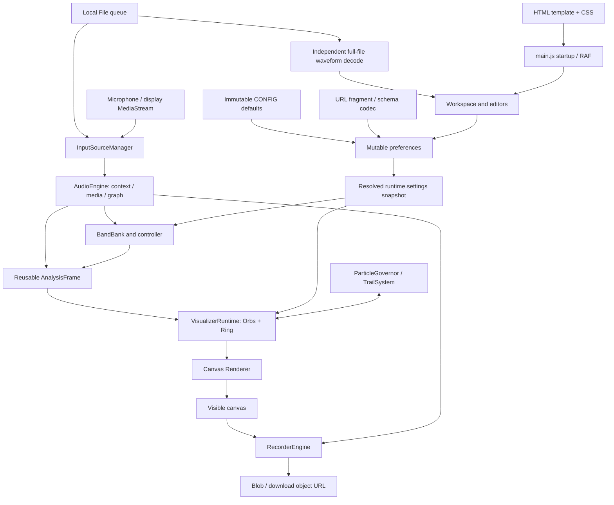

# Codebase Audit — Auralprint

Generated: **2026-10-09 00:42:38 (UTC)**

Repository: `Auralprint1`; working branch: `work`

Audited baseline: `f5bbf2a25ffbf8b122e81bd9f54e3639a53a6243` (`Adding deployment assets`)

Implemented development version: **`v0.1.15m.i.c`**, read from root `version`

Scope: current application, tests, build/CI, supporting tools, assets, and historical-artifact boundaries. Production source and tests were not modified.

## 1. Executive Summary

Auralprint is a browser-only audio analyzer and canvas visualizer. It accepts queued local files, microphone input, and browser-selected display/tab streams; analyzes left, right, and combined channels; drives a configurable collection of Orbs and a Spectral Ring; serializes appearance/analysis preferences into a URL fragment; and records the rendered canvas together with source audio. The build produces a versioned HTML file with JavaScript and CSS embedded. There is no application backend, database, authentication system, or production server dependency in this repository.

The main analysis/rendering design is coherent. Several difficult resource and compatibility problems have explicit solutions: stable Orb identities, bounded scene-wide particle admission, ordered particle expiration, cancellation tokens, versioned preset sanitation, and distinct ownership of live-input tracks versus recorder-created tracks. Normal native Chromium file playback/recording and synthetic stereo live-input analysis/recording worked in this audit. The existing Node suite and build also passed after an offline locked dependency installation.

The most important confirmed defect is a transport identity race: removing a queued file while its initial activation is pending, with another file still present, does not invalidate the pending activation. The removed file can begin playing while the Queue marks its successor active. Context startup/resume failures also escape the intended error handling and leave a source in `requesting` without a useful error. These are current behavioral defects, not conclusions drawn from old remediation reports.

Other confirmed weaknesses occur at representation boundaries: the analysis bank accepts 3–256 bands while Orb target validation and the picker retain a fixed 256-band universe; inventory refresh destroys keyboard focus on an unrelated preference application; and the frame loop repeatedly writes unchanged DOM attributes despite narrower refresh caches. Long recordings and waveform decoding have no admission limits on retained media memory. Those memory findings are conditional risks; exhaustion was not induced.

There are **14 findings: 0 Critical, 1 High, 6 Medium, 5 Low, and 2 Informational**. Twelve are Confirmed; two resource risks are Conditional. No verified injection or remote-code-execution defect was found. A broad rewrite is not justified by the evidence. Repair transport identity/error settlement first, then align analysis targeting and UI reconciliation, and establish explicit media-memory policies. Preserve the resource ownership and particle-governance architecture while doing so.

## 2. Audit Scope and Method

### Evidence standard and coverage

Implementation was treated as authoritative. Documentation, comments, test names, test expectations, and previous audits were evaluated as claims or supporting evidence. Every current production JavaScript module was inspected across its producers, consumers, initialization, and relevant disposal/error paths. The HTML template and CSS were reviewed for wiring, ownership, accessibility, packaging, and rendering behavior. The tests, fixtures, dependency manifests, CI workflow, build/watch/assembly path, and validation/measurement tools were inspected. Historical complete HTML applications and the large prior-audit collection were inventoried and their relationship to the current build checked; they were not all rebuilt, executed, or reread byte for byte.

Investigation traced startup; frame scheduling; settings resolution; all source modes; queue navigation/removal/clear/EOF; band construction and sampling; Orb selection/color/trail admission; Ring synchronization; recording start/stop/export/disposal; waveform decoding/seeking; panel/editor reconciliation; schema migration and URL application; and production/watch assembly. Lateral investigation followed identity, ownership, numeric-range, and refresh-cache defects across adjacent modules.

### Executed checks

| Check | Outcome and interpretation |
|---|---|
| Git baseline/status, tracked inventory, reference searches, line-numbered source reads | Baseline clean on `work`; 594 tracked files before this report. No pre-existing user edits were present. |
| Initial `npm test` | Could not resolve `esbuild` because dependencies were absent. This was a bootstrap condition, not an application finding. |
| `npm ci --offline --cache /workspace/auralprint-environment/npm-cache --ignore-scripts` | Succeeded using the supplied cache; two packages installed. Lockfile unchanged. The pre-provisioned esbuild executable was supplied through the environment's `ESBUILD_BINARY_PATH`. |
| `npm test` after installation | Passed: Node runner reported 41 discovered test files, 41 pass, 0 fail. These are file-level results in this runtime, not a claim of only 41 assertions or of comprehensive coverage. |
| `npm run build`, after tests completed | Succeeded; generated `dist/auralprint_0.1.15m.i.c.html`, 400,363 bytes. Bundles were approximately 342.9 KB JavaScript and 25.3 KB CSS. |
| Current-module numerical diagnostics | Reproduced fixed-universe target mismatch, logarithmic overflow, and the Nyquist-limited top-band observation. |
| Headless Chromium 151.0.7922.173, local intercepted HTML | Ordinary playback and native MediaRecorder export passed without page errors; targeted fault/delay diagnostics reproduced transport/error/focus/DOM findings. |
| Synthetic native stereo MediaStream | Oscillator signals near 440/880 Hz remained distinct in L/R analysis. Recording completed and upstream audio track remained live afterward. This did not exercise OS permission dialogs. |
| Watcher on a disposable repository copy | Template-only edits did not rebuild; a subsequent JS change used the changed template; version edits did not change the output version/path in the running watcher. |
| 375×667 Chromium viewport | Initial visible Audio panel and launcher fit the viewport. This is a narrow smoke check, not physical-device acceptance. |

Runtime versions were Node 24.19.0 and Python 3.12.14; the lockfile resolved esbuild 0.25.12. Tests/build were run sequentially because repository tests manipulate temporary build paths. The optional million-particle stress path was not enabled. No existing test was changed to obtain a passing result.

### Diagnostic isolation and limitations

Diagnostic scripts/results stayed outside the repository in temporary audit workspace files. Browser navigation requests were intercepted: the local HTML response was supplied in memory, and other page requests were aborted. The normal playback/recording smoke test used the unmodified built HTML. State-inspection scenarios used an in-memory copy exposing existing module symbols immediately before the unchanged `main()` call; fault scenarios additionally replaced the AudioContext constructor/resume method or disabled RAF. Production source and generated HTML on disk were not patched. This distinguishes observed production behavior from controlled fault injection.

Chromium could not launch inside the default sandbox because of an environment `EPERM`; the local diagnostic invocation was approved by automatic approval review and then completed. No external service was intentionally contacted; no hosted CI run, release, deployment, publication, registry advisory query, real microphone/display permission grant, or destructive stress test was performed. Browser request interception and background-networking suppression limited the browser checks to local evidence. Large-input memory exhaustion, real mobile/GPU performance, Firefox/Safari behavior, and native display capture remain unverified.

The only persistent repository modification is this report. Offline dependency installation and the normal build produced ignored `node_modules/`, `.build/`, and `dist/` artifacts. No lockfile, production code, test, configuration, existing documentation, or historical report was edited. Findings below include enough source references and reproduction procedures to survive loss of temporary diagnostics.

## 3. Reconstructed Architecture



`src/js/main.js` is the only active browser execution entry. Its bundled IIFE is embedded by the Python assembler in `src/index.template.html`. Imports and mutable module singletons implement dependency wiring; there is no service container, router, worker message system, or external event bus.

The principal state representations are:

| Representation / owner | Actual role and boundary |
|---|---|
| `core/config.js :: CONFIG` | Deep-frozen defaults and configuration constants. It is a baseline, not the active mutable state. |
| `core/preferences.js :: preferences` | Mutable user-editable scene/analysis/Orb preferences. URL presets and UI actions write this representation. |
| `core/preferences.js :: runtime.settings` | A resolved deep-cloned snapshot. `resolveSettings()` normalizes selected shared values; `UI.applyPrefs()` also normalizes Orb definitions and synchronizes runtime objects/UI. Snapshot identity changes on application. |
| `core/state.js :: state` | Volatile canvas/dimensions/time, audio/source projections, recording, analysis-bank arrays, Orb runtime objects, and UI state. These values are not all serialized. |
| `audio/queue.js :: Queue` | File references and cursor. Queue cursor is separate from pending load identity and active media identity. This split is material to AUD-001. |
| `audio/input-source-manager.js :: InputSourceManager` | Source activation sequence, active source session, capture permission/support projections, and ownership of live tracks. |
| `audio/audio-engine.js :: AudioEngine` | Singleton context, media element, object URL, graph nodes, cancellation hooks, sampling, playback gain, and recorder audio taps. |
| `recording/recorder-engine.js :: RecorderEngine` | MediaRecorder lifecycle, retained chunks, recorder-owned render tracks, audio-tap release, finalized export and URL. Projects status into `state.recording`. |
| `render/orb.js`, `orb-runtime.js`, `visualizer-runtime.js` | Identity-preserving Orb runtime state, scene visualizer registry, update/render/reset order. |
| `particle-governor.js`, `trail-system.js`, `particle-list.js` | Shared admission/accounting and per-trail chronological storage, expiration, eviction, and disposal. |
| `ui/workspace.js` and feature editors | DOM ownership, workspace visibility/focus, editor identity, panel-specific reconciliation. `ui.js` still coordinates most cross-subsystem actions. |

The useful module separation coexists with shared singleton state. Recorder dependencies are partly injected, but recordability still consults global source state. UI transport coordinates Queue, AudioEngine, InputSourceManager, Scrubber, visual reset, and recorder notifications. There are multiple cancellation domains: source activation sequence, media-load abort, UI request ID, waveform token, and recorder generation/disposal guards. They protect different boundaries and must not be assumed interchangeable.

## 4. Repository / Component Inventory

The following classification covers all 594 baseline tracked files; categories are roles rather than a list of trivial filenames.

| Portion | Files | Actual significance |
|---|---:|---|
| `src/js/` | 38 | Current browser implementation: core configuration/state/identity, audio analysis and transport, visual runtime/resources, UI, presets, recording. |
| `src/css/` | 9 | Bundled application/workspace/editor/control styling. |
| `src/assets/branding/` | 8 | Favicon/application icons, manifest, and social branding; not copied by the current application build (AUD-010). |
| `scripts/` | 43 | Build/watch/Python assembly plus release-specific validation and measurement tools. Many diagnostics require externally provided Playwright/browser capabilities and are outside `npm test`. |
| `tests/` | 45 | 41 test files, one lightweight DOM helper, and three preset fixtures. A mixture of pure state/numeric tests, fake-media tests, and structural/build tests. |
| `docs/Canon/` | 6 | Five historical complete HTML applications and a changelog; independent snapshots, not active build inputs. Approximately 880 KB. |
| Earlier audit/evidence/remediation documentation | 436 | Approximately 14 MB of historical conclusions and outputs. Useful provenance, not proof that current code is correct. Not imported by the application. |
| Root/CI/template and remaining project files | 9 | `package.json`, lockfile, `version`, ignore rules, README, ROADMAP, lowercase `agents.md`, CI, HTML template. |

Current `src` text totals approximately 10,342 lines; scripts 3,562; tests 11,406. `ui.js` alone is approximately 1,876 lines and RecorderEngine is another substantial coordinator. Module size matters here because lifecycle and reconciliation decisions cross many branches, not because line count itself is a defect.

Languages/toolchain are browser JavaScript ES modules, HTML, CSS, Node build/test scripts, Python assembly, JSON fixtures/lockfile, and GitHub Actions YAML. The only declared direct dependency is development-only esbuild. No runtime package, backend endpoint, SQL store, migration, service worker, container/deployment infrastructure, authentication middleware, plugin host, or application socket was found. OS/browser APIs provide media capture and export. Historical validation tools are developer executables, not browser runtime components.

## 5. Runtime and Data-Flow Analysis

### 5.1 Startup and frame clocks

`main.js :: main()` applies configured CSS values, obtains the 2D canvas context, resolves defaults/preferences, applies an incoming URL preset, and resolves again. It initializes source handling with a UI visual-reset callback, synchronizes the band controller, initializes Orbs/visualizer membership, initializes recording with canvas/audio accessors, wires the UI, applies preferences, and initializes the scrubber. Resize and visibility listeners precede the animation loop.

The frame callback schedules its successor before doing work. It updates canvas geometry, separates emission `dtSec` (bounded at approximately 1/30 second), motion elapsed time (larger bounded intervals, with long/hidden gaps discarded), and real monotonic `nowSec`. Audio sampling fills the reusable AnalysisFrame, visualizers update, then renderer composition draws the Ring before Orbs. UI refresh and scrubber drawing also run per frame. The visualizer update order is different: Orbs update, the particle-governor frame is finished, and Ring phase can observe the current Orb angle. Tests meaningfully exercise this same-frame phase relationship.

Motion pause is not a freeze of all time. Orb movement and emission pause, while existing trail lifetime retirement uses real time. Large hidden-tab gaps do not become a deferred motion/emission debt. Recorder elapsed-time/status handling also has an independent 200 ms interval, so it is not wholly coupled to RAF. Browser encoder/background throttling remains an external limit.

### 5.2 File ingest, selection, queue, and EOF

File input/drop actions add accepted File objects to Queue and enter `UI.loadAndPlay()`. That function increments a UI load request ID, resets track visual state, calls `InputSourceManager.activateFile()`, checks the request ID after the await, then loads waveform data, applies preferences, updates recorder transport state, and refreshes Queue/UI. Previous/next/click/EOF actions use the same loader.

The source manager increments its activation sequence and tears down the preceding session. AudioEngine creates an audio element and object URL, installs abort/readiness handlers, waits for readiness, attaches the graph, and plays. Abort/disposal normally pauses the media, removes listeners, revokes the object URL, and disconnects nodes. Post-await guards suppress stale successful commits. They are effective when the caller actually invalidates the activation; removing a pending cursor item while a successor remains fails to do that (AUD-001).

EOF is coordinated with recording completion, queue repeat/cursor advancement, and `pendingTrackEnd`. This is a substantive state machine distributed through closures in `UI.wireControls()`, rather than a pure Queue responsibility. Queue labels/cursor and AudioEngine filename are separate identity representations. UI load IDs are local closure state and cannot by themselves protect changes not routed through the loader.

### 5.3 Microphone and display/tab streams

InputSourceManager probes API support and creates mode-specific descriptors. Microphone capture uses getUserMedia constraints; display capture requests video and optional audio through getDisplayMedia. Where supported, constraints ask for stereo and disable processing such as echo cancellation. The browser/device may choose different channels or omit display audio. The code checks received tracks, uses activation guards for late capture results, monitors source ending, and owns stopping upstream tracks.

Live sources attach to AudioEngine with speaker monitoring disabled; the browser is not asked to echo a captured mic/display stream into the speakers. Source replacement/disposal is owned by InputSourceManager. AudioEngine disconnects its graph but does not claim ownership of all live input tracks. Synthetic native stereo capture in this audit exercised attachment, sampling, and recording; actual chooser/permission/system-audio behavior was not tested.

### 5.4 Channel graph and spectral analysis

`AudioEngine.buildGraph()` connects the source to a splitter and L/R analyzers. Weighted L/R paths feed the combined C analyzer. When one channel is effectively silent, combination can favor the non-silent channel; otherwise weights are approximately 0.5/0.5. File audio also goes through `outputGain` to the destination; live monitoring is suppressed. Analysis is taken before output volume/mute, so changing playback volume does not intentionally change reactive analysis. File recording audio uses the playback-side tap; live recording obtains a source-compatible tap. This difference should remain explicit in product/test expectations.

`sample()` gathers waveform/frequency arrays, RMS/channel-correlation information, normalized band energies, and dominant-band data. AnalysisFrame exposes reused producer-owned arrays; consumers must read them during the frame and not retain them as immutable historical snapshots. Normalized band energy is an average of normalized decibel values over mapped FFT bins, not physical power integration. Neighboring bands can share an endpoint bin because mapping uses floor/ceil and an inclusive loop. Existing FFT-coordinate tests deliberately pin this behavior; this audit does not misclassify that defined approximation as a new overlap defect.

BandBank reserves band 0 for `[0, floor]`, allocates `count-2` interior bands in the selected linear/log/mel/bark/erb domain, and reserves the last band for `[effective ceiling, Infinity]`. Sampling caps that open-ended range at Nyquist. The controller tracks definition/sample-rate changes. Count normalization accepts 3–256. A Nyquist-limited final band can have no width (AUD-013), and extreme accepted log floors can overflow intermediate ratios (AUD-008). Targets and labels do not fully follow accepted count changes (AUD-003).

### 5.5 Orbs, Ring, color, and particle resources

Orb definitions are normalized and admitted with stable opaque IDs. Collection operations preserve surviving identity/runtime state; runtime synchronization updates properties rather than replacing all Orbs. Each Orb owns motion phase, response, emission/trail state, and local channel/band/color overrides. Empty band targets select full-spectrum channel behavior; nonempty targets average selected channel energies. Inherited dominant color can use the Orb's selected/channel-local dominant band, while an explicit global-dominant policy uses C/global dominance.

VisualizerRuntime maintains scene membership and separates update from render composition. The Spectral Ring is one scene visualizer with free phase or Orb-0 lock; an empty Orb collection is handled without dereferencing a missing Orb. Orb removal disposes its trail resources and updates aggregate accounting.

ParticleGovernor defaults to 512 emissions per update and 16,384 retained particles scene-wide, with allowed ceilings of 16,384 and 1,048,576 respectively. It uses fair admission and oldest birth/sequence eviction with an indexed heap. Fractional demand is retained without accumulating an unbounded whole-particle debt. TrailSystem uses chronological intrusive storage; ordered expiration removes a prefix, while out-of-order cases take a conservative path. Same-Orb retained-particle spacing scales by active DPR. These are explicit controls, not an absence of resource governance. Their existence does not bound media buffers or UI DOM size.

### 5.6 Record, finalize, export, and dispose

RecorderEngine tests feature/source availability, captures the render canvas, acquires source audio, assembles a MediaStream, chooses a supported MIME configuration, and starts native MediaRecorder. Data events append chunks; stop/finalization assembles a Blob, creates an export URL/filename, and releases session capture resources. A previous successful export remains available until replacement succeeds; replacement revokes its old URL. A failed subsequent recording therefore need not destroy the user's last export.

Recorder-created canvas/video tracks are stopped on cleanup. The acquired audio tap is released through its owner; upstream live source tracks remain the source manager's responsibility. Generation/disposal guards prevent stale callbacks from reactivating disposed recorder state. Native synthetic-live recording confirmed the upstream track was still `live` after completion. The periodic data timeslice is delivery segmentation, not a memory cap; all pending chunks remain retained (AUD-006).

### 5.7 Waveform and seek

Scrubber independently reads the full File into an ArrayBuffer and calls OfflineAudioContext decoding. It derives 512 multichannel waveform peaks, stores only the peaks after completion, and uses a load token to discard stale completions. That token does not cancel a decoder already in progress (AUD-007). Pointer drag ownership and coordinate conversion have dedicated tests. Seeking ultimately targets the active AudioEngine media element. Global keyboard handling excludes relevant form-control contexts and exposes seek/navigation shortcuts; the scrubber canvas itself is not a complete semantic slider widget.

### 5.8 Preferences, URL schemas, and UI reconciliation

PresetCodec migrates schemas 2–10 into the current preference model and constructs a whitelisted/default-based sanitized result. Schema-9 alternate layouts have explicit precedence. It validates opaque IDs, channels, colors, enum/numeric settings, particle limits, Orb admission, and nested structures. URL encode/decode uses base64url JSON in the fragment; files, media streams, recording chunks, and transient runtime state are not included. Invalid payloads return failure rather than merging arbitrary runtime objects. URL application changes preferences; the caller remains responsible for applying them to runtime/bands/UI.

Workspace owns panel visibility, focus destinations, z-order, and ResizeObserver lifecycle, with idempotent initialization. Editors retain runtime/settings references and reconcile their own controls. Phase editing specifically permits fractional native range values. Other ranges can disagree with sanitized fractional imports (AUD-009). Visualizer inventory rebuild is keyed to settings identity; an unrelated clone can destroy focused nodes (AUD-005). The global refresh path also bypasses some recorder caches and repeatedly writes tooltips/ARIA attributes (AUD-004).

### 5.9 Build and watch

`scripts/build.mjs` reads root `version`, bundles `main.js` and `base.css` for ES2020, writes a combined esbuild metafile, and runs `assemble_single_file.py`. The assembler embeds JS/CSS into the template and inserts version metadata. Python selection supports `PYTHON`, Python command variants, and Windows `py -3`. Build warnings classified as CSS syntax errors are treated as fatal.

The normal build produces the versioned HTML and metadata, not the branding tree. The manifest/root icon URLs consequently require an additional hosting layout (AUD-010). Watch creates JS/CSS esbuild contexts; template and version are outside their dependency graph. Imported module-level version metadata remains fixed for the process (AUD-011).

## 6. Findings Summary

Confidence uses the requested categories. **Confirmed** means direct code evidence and/or local reproduction; it does not imply the trigger is common. **Conditional** identifies a traced risk requiring the stated workload. No finding below relies solely on a prior report or test name.

| ID | Severity | Confidence | Area | Finding |
|---|---|---|---|---|
| AUD-001 | High | Confirmed | Transport identity | Removing a pending cursor file can leave that removed file playing under its successor's Queue selection. |
| AUD-002 | Medium | Confirmed | Failure recovery | Context creation/resume errors escape file/play handling and leave misleading source/transport state. |
| AUD-003 | Medium | Confirmed | Analysis targets | Variable band count and fixed 256-band target/picker validation disagree. |
| AUD-004 | Medium | Confirmed | UI performance | Per-frame refresh performs unchanged DOM writes and bypasses recorder refresh gating. |
| AUD-005 | Medium | Confirmed | Accessibility/reconciliation | Unrelated preference application replaces focused Visualizers inventory nodes. |
| AUD-006 | Medium | Conditional | Recording memory | Entire recordings remain in memory without a duration/byte admission policy. |
| AUD-007 | Medium | Conditional | Waveform memory | Whole-file PCM decoding is unbounded and stale decoder work is not cancelled/admitted. |
| AUD-008 | Low | Confirmed | Numeric robustness | Accepted extremely small log floors overflow a ratio and collapse most bands. |
| AUD-009 | Low | Confirmed | Editor consistency | Fractional imported values disagree with native stepped range values. |
| AUD-010 | Low | Confirmed | Packaging | Build omits branding assets referenced by HTML; manifest assumes a different host layout. |
| AUD-011 | Low | Confirmed | Developer build | Watch ignores template-only changes and caches version metadata. |
| AUD-012 | Low | Confirmed | Onboarding docs | Root current-version/artifact examples lag implemented `v0.1.15m.i.c`. |
| AUD-013 | Informational | Confirmed | Analysis semantics | Default ceiling at 44.1 kHz leaves the final band with zero effective width. |
| AUD-014 | Informational | Confirmed | Compatibility/lifecycle seams | Inactive aliases, unreachable presentation paths, and one-shot initialization assumptions remain. |

## 7. Detailed Findings

### AUD-001 — Pending file removal does not cancel the removed activation

**Severity:** High

**Confidence:** Confirmed

**Area:** Queue/source/media identity

**Affected code:** `src/js/ui/ui.js :: hasActiveFileSource()` (34–36), `wireControls()` load-request helpers and `loadAndPlay()` (approximately 1280–1405), Queue remove callback (1542–1565); `src/js/audio/queue.js`; `src/js/audio/input-source-manager.js :: activateFile()` (439–488).

**Finding:** Removing the current queued File while it is still activating, with another item left in the Queue, does not invalidate the pending UI/source activation. The File no longer exists in Queue but can still become the active media source.

**Evidence:** The removal branch determines `wasActive` through `hasActiveFileSource()`, which requires loaded audio. During the pending phase `state.audio.isLoaded` is false, so removal is treated as removing a nonactive item. Queue adjusts its cursor to the successor. An empty Queue has a cancellation/reset path, but a nonempty Queue with this pending item removed does not bump the relevant request ID or dispose/replace the pending activation. `loadAndPlay()` can therefore pass its post-await request guard.

Chromium reproduction used two synthetic stereo WAV Files, `removed-A.wav` and `surviving-B.wav`, and deferred the first AudioContext resume to make the race deterministic. After removing A and before releasing resume, Queue contained only B, cursor 0, while source status was `requesting` for A. After release: Queue still marked B active, AudioEngine reported `filename: removed-A.wav`, `isLoaded: true`, `isPlaying: true`, and source status was `active` for A. There were no page errors. The browser delay was injected; the divergent state afterward was produced by the existing code.

**Impact:** Primary playback and Queue identity disagree. A user's removal does not prevent the removed file from playing; navigation, EOF, labels, and recording can subsequently act on inconsistent source/cursor representations. Severity is based on incorrect primary transport behavior, not data destruction.

**Trigger / Conditions:** Remove the cursor File during pending activation, with at least one other File remaining. A slow resume/readiness stage makes the window observable. Normal fast local playback can hide it.

**Root Cause:** Active identity is inferred from “already loaded” state and Queue cursor; pending activation identity is not part of the removal invariant. Multiple cancellation tokens exist, but this branch does not invalidate the owning one.

**Recommendation:** Give each activation a stable File/item identity and make Queue mutation invalidate or replace an activation whose identity is removed, whether pending or loaded. Define the desired successor policy explicitly. Check that identity again before media/source commit and before applying post-load UI work. Add a deterministic delayed-resume/readiness regression before altering cancellation wiring.

**Related Findings:** AUD-002. Preserve existing cancellation behavior for clear, live-source switching, and rapid successive loads.

### AUD-002 — AudioContext startup/resume failures bypass error settlement

**Severity:** Medium

**Confidence:** Confirmed

**Area:** Async transport failure handling

**Affected code:** `src/js/audio/audio-engine.js :: loadFile()` (293–390, context/resume at 300–305 before later try block), `playPause()` (392–414); `src/js/audio/input-source-manager.js :: activateFile()` (439–488); `src/js/ui/ui.js` async file/drop/play handlers.

**Finding:** Context construction/resume runs outside the load method's guarded media error path. An exception/rejection propagates through source activation and async UI handlers without settling source and transport error projections.

**Evidence:** `loadFile()` ensures/resumes the context before its later guarded load work. `activateFile()` has already published a `requesting` descriptor and awaits the engine without handling this early rejection. File input and drop handlers await enqueue/load without an enclosing error conversion. `playPause()` has a similar resume outside the guarded `media.play()` path.

An AudioContext subclass with a suspended context and a `resume()` rejection using `InvalidStateError` reproduced an unhandled browser page error. After selecting `failure.wav`, source remained `kind: file`, `status: requesting`, with empty `errorCode`/`errorMessage`; audio was unloaded with empty `transportError`; Queue marked the item active. The status text said “File mode ready. Select a queued file or load audio files.” This proves mishandling of that fault, not the rate at which real browsers reject resume.

**Impact:** Failed activation is presented as readiness/requesting rather than actionable failure. Errors become unhandled promises, and callers cannot reliably determine whether source activation settled. Retry and recorder readiness may consult stale projections.

**Trigger / Conditions:** AudioContext creation fails or resume rejects, including a closed/unavailable context or browser-specific audio startup failure. The diagnostic deliberately forced refusal.

**Root Cause:** Error handling covers media readiness/play but not the complete activation transaction. Source status is written before an await whose rejection does not converge on a settlement path.

**Recommendation:** Guard context construction/resume and media setup as one activation boundary. Convert failures to structured engine/source status, release partially owned resources, and settle only the still-current activation. Have UI async event boundaries contain unexpected rejection as a final safeguard. Cover both initial load and resume-on-play.

**Related Findings:** AUD-001; both depend on an explicit activation identity and terminal-state contract.

### AUD-003 — Accepted band counts do not constrain Orb targets or picker choices

**Severity:** Medium

**Confidence:** Confirmed

**Area:** Configuration-to-analysis invariant

**Affected code:** `src/js/core/preferences.js :: normalizeBandCount()` (25–31), `normalizeOrbBandIds()` (59–86); `src/js/presets/preset-codec.js`; `src/js/ui/orb-band-picker.js` rows/validation (approximately 6–17, 87–106); `src/js/ui/orb-editor.js`; `src/js/render/visualizer-runtime.js :: selectOrbAnalysis()` (11–40); `src/js/audio/band-bank.js :: rebuild()`.

**Finding:** The bank genuinely supports fewer than 256 bands, but target sanitation and picker enumeration validate against `BAND_NAMES.length` (256), rather than the active bank count. Validly sanitized targets can reference nonexistent energies.

**Evidence:** A schema-10 preference object with `bands.count: 3` and an Orb targeting `[255]` survives `sanitizePreset()`. After rebuilding, the C energy array has length 3. Filling its existing values with 0.5 still yields `selectOrbAnalysis(...).energyOverride01 === 0` for target 255. Selecting `[0,255]` would average 0.5 and the missing-entry fallback 0, yielding 0.25 rather than 0.5. The denominator includes all requested targets. Native UI inspection with count 3 reported band 255 range `n/a`, while the editor advertised accepted indices `0–255`.

**Impact:** Imported/configured scenes can silently suppress or dilute Orb response and choose a nonexistent dominant target. The UI validates a selection that has no corresponding spectral range. This is a cross-layer semantic mismatch, not an array exception.

**Trigger / Conditions:** Any nondefault count with an Orb target at or above that count. Count is reachable through sanitized presets even if normal interactive controls favor the default 256.

**Root Cause:** A fixed name table is being used as an active bank cardinality contract. Count sanitation, migration, target sanitation, picker generation, and runtime consumers do not share one range definition.

**Recommendation:** Decide whether targets are stable semantic bins or indices into the current bank. For index semantics, constrain picker and runtime validation to the active count and explicitly handle targets when the count shrinks. Define migration behavior before pruning/remapping persisted selections. Preserve fixed legacy labels only where they are actually compatibility metadata.

**Related Findings:** AUD-008 and AUD-013 concern other accepted-bank geometry boundaries.

### AUD-004 — Global frame refresh repeatedly mutates unchanged UI

**Severity:** Medium

**Confidence:** Confirmed

**Area:** DOM work and scaling

**Affected code:** `src/js/main.js` frame callback; `src/js/ui/ui.js :: refreshAllUiText()` (1129–1187), `refreshRecordingUi()` (1010–1076), `maybeRefreshRecordingUi()` (1078 onward), tooltip refresh (567–580).

**Finding:** Refresh paths include useful state caches but still perform unchanged tooltip, source, launcher, recorder, and accessibility writes each frame. `refreshAllUiText()` ends with an unconditional recorder UI refresh, bypassing the narrower recorder-refresh gate.

**Evidence:** A MutationObserver after one priming refresh recorded **7,260 DOM mutations for 60 further refresh calls** on an idle default scene, including **5,340 title writes and 1,020 ARIA writes**. The synchronous batch took approximately 12.4 ms on this host. A separate RAF-disabled batch of 30 calls took approximately 7.3/13.9/30.5 ms for 2/16/64 Orbs, with 140/574/2,062 form/button/select elements. These are local synchronous measurements, exclude full rendering/painting, and are not claimed as a production FPS benchmark. They demonstrate work despite unchanged state and growth with editor inventory.

`refreshConfigTooltips()` iterates controls and assigns titles again. Source and recorder presentation similarly assign some unchanged attributes. This work is not consistently conditioned on whether the owning panel is visible.

**Impact:** Idle scenes consume avoidable main-thread work. Large valid Orb inventories amplify control traversal/mutation, competing with audio-driven drawing and input responsiveness. Existing particle budgets do not limit this UI cost.

**Trigger / Conditions:** Every normal RAF refresh, especially large inventories or hidden panels. Only up to 64 Orbs were measured; no claim is made that the admitted maximum 4,096 is interactive.

**Root Cause:** “Refresh all” mixes settings reconciliation, dynamic telemetry, tooltip generation, and recorder/source projection. Cache guards exist around individual paths but are defeated by downstream unconditional calls/assignments.

**Recommendation:** Split settings-driven and telemetry-driven presentation. Cache tooltip/attribute values, gate hidden-panel work where appropriate, and remove duplicate recorder projection after defining one owner. Measure idle mutation count and representative scene frame cost before/after; preserve timely error/status updates.

**Related Findings:** AUD-005 and AUD-009 share settings-to-DOM reconciliation issues.

### AUD-005 — Inventory rebuild loses focus after unrelated preference changes

**Severity:** Medium

**Confidence:** Confirmed

**Area:** Keyboard/accessibility and async UI reconciliation

**Affected code:** `src/js/ui/visualizers-panel.js :: render()` (62–101, `replaceChildren()` around 100), `refresh()` (129–142); `src/js/ui/ui.js :: applyPrefs()` (421–444), `loadAndPlay()`; `src/js/core/preferences.js :: resolveSettings()`.

**Finding:** The Visualizers inventory uses a changed settings object reference as a reason to recreate its DOM. Applying unrelated preferences creates a new runtime snapshot and removes the focused inventory control without general focus restoration.

**Evidence:** In Chromium, focus was placed on an inventory Edit button. Changing audio volume and calling the normal `applyPrefs()`/refresh path disconnected that button and moved `document.activeElement` to `BODY`. Add/remove-specific restoration does not cover this unrelated refresh. The file-load completion path also applies preferences, so an async completion can cause the same recreation while the user is already navigating the inventory.

**Impact:** Keyboard navigation loses its position and focus destination; subsequent shortcuts can operate at the page level rather than the intended inventory. The failure affects accessibility and can interrupt work during asynchronous source loading.

**Trigger / Conditions:** Inventory control is focused when preferences are reapplied, even when inventory membership/order/labels are unchanged. The direct volume/application reproduction is confirmed; the async load manifestation follows the same traced application path.

**Root Cause:** Snapshot identity is treated as inventory structural identity. Stable Orb identity exists in the model but is not used to preserve every inventory DOM node/focus across general refresh.

**Recommendation:** Reconcile rows by stable visualizer ID or rebuild only when inventory structure changes. Preserve focus/action identity when replacement is necessary. Test external preference application and delayed file-load completion while inventory controls are focused, as well as intentional removal of the focused row.

**Related Findings:** AUD-004. Preserve Workspace's explicit launcher/panel focus destinations.

### AUD-006 — Recorder has no retained-media admission limit

**Severity:** Medium

**Confidence:** Conditional

**Area:** Recording resource policy

**Affected code:** `src/js/recording/recorder-engine.js` data handler (`pendingChunks.push`, around 1206), Blob assembly (691–737), final export/replacement (1019–1076).

**Finding:** Recording retains all nonempty MediaRecorder data chunks until finalization and keeps the completed export in memory. No duration, byte, available-memory, or backpressure policy bounds a session. A previous completed export is intentionally retained during the next session.

**Evidence:** The timeslice causes periodic data delivery, but each delivered Blob is appended; it is not persisted away or evicted. Final assembly creates a Blob over the retained chunks. Old-export replacement/revocation is carefully handled, but it does not cap pending data or simultaneous old-export/new-session retention. No corresponding byte/duration admission boundary was found in recording settings/start/status paths.

**Impact:** Long or high-bitrate recordings can exhaust browser/process memory or fail near completion, potentially losing the current capture. Blob implementations may share storage rather than copy all bytes; the audit does not claim a guaranteed double allocation during assembly. The missing bound remains regardless of that implementation detail.

**Trigger / Conditions:** Workload exceeds practical browser/device capacity. No OOM was induced, and no maximum safe duration can be inferred from the short successful native samples.

**Root Cause:** Recording lifecycle correctness is explicit, but media-size admission is implicit. Segmentation is treated as an event mechanism without a storage policy.

**Recommendation:** Define a supported recording budget and expose progress/limit behavior. Where product/platform requirements allow, stream chunks to an explicit user-selected persistence sink; otherwise bound retained bytes/duration and stop/finalize before exhaustion. Preserve the prior export and clarify failure behavior. Test accounting with controlled chunk sizes without allocating dangerous buffers.

**Related Findings:** AUD-007. Particle admission does not bound either media subsystem.

### AUD-007 — Waveform generation decodes complete files and permits overlapping stale work

**Severity:** Medium

**Confidence:** Conditional

**Area:** Decode memory and async work admission

**Affected code:** `src/js/audio/scrubber.js :: loadFile()` (72–105; ArrayBuffer/read/decode around 80–85), `reset()` (107–113), peak construction (15–43); `src/js/ui/ui.js :: loadAndPlay()`.

**Finding:** A streamed-playback File also receives a full-file read and full PCM decode solely for waveform peaks. Tokens suppress stale results but do not cancel already-started decoding or cap concurrent work/file size.

**Evidence:** `loadFile()` awaits `file.arrayBuffer()`, constructs an OfflineAudioContext, and awaits `decodeAudioData()`. Token checks around these steps protect result commitment, not the native work in progress. Peak reduction retains only a small result after completion, but the decoder still needs the full decoded audio. Reset/new load increments the token without stopping a started decode.

At 44.1 kHz, a one-hour stereo Float32 decoded buffer alone is `3600 × 44100 × 2 × 4 = 1,270,080,000` bytes, approximately **1.18 GiB**, before the encoded file buffer and decoder overhead. This is an arithmetic resource estimate, not an observed allocation/OOM. Rapid switching can leave multiple old decodes in flight even though their results cannot overwrite the latest waveform.

**Impact:** Long files can fail or destabilize an otherwise playable streaming session; rapid switching can create transient memory/CPU spikes. A correct latest-result guard can therefore coexist with costly stale work.

**Trigger / Conditions:** Large/long encoded files or repeated source changes during decoder work. Browser-specific native scheduling and limits determine actual failure thresholds.

**Root Cause:** Result freshness and work admission are separate concerns, but only freshness has a policy. Waveform generation is coupled to a full decode rather than a bounded optional capability.

**Recommendation:** Establish waveform limits independently of playback. Serialize/admit decode work, estimate/limit encoded size and duration where possible, and allow playback with an explicit unavailable/deferred waveform. Consider bounded/incremental peak generation where supported. A worker can move CPU work but is not itself a memory cap or a guarantee of native cancellation.

**Related Findings:** AUD-006; both require a media-resource policy with graceful degradation.

### AUD-008 — Extreme positive log floors collapse the interior bank

**Severity:** Low

**Confidence:** Confirmed

**Area:** Numerical validation/interpolation

**Affected code:** `src/js/presets/preset-codec.js` band sanitization; `src/js/audio/band-bank.js :: computeInteriorEdges()` (18–37, log ratio at 30–32), `rebuild()` (84–114).

**Finding:** Extremely small but accepted positive `floorHz` values make `f1/f0` overflow before exponentiation. Clamping hides the nonfinite intermediate by collapsing interior edges to the effective ceiling.

**Evidence:** Sanitizing schema 10 with `floorHz: 1e-307`, log distribution, and ordinary defaults retained that floor. Rebuilding at ceiling 22,500 Hz/sample rate 48,000 Hz produced first low edges `[0, 1e-307, 22500, 22500, 22500]`. With every FFT dB sample set to -50 on a -100..0 scale, **253 of 256 band energies were zero**; ordinary floor 20 yielded none zero in the same diagnostic. `Number.MIN_VALUE` reproduced the collapse. Final stored edges were finite because of clamping; this is not a claim that NaN arrays escape.

**Impact:** A validly accepted crafted/pathological preset produces a nearly degenerate bank and poor visual response. Typical user floors are unaffected.

**Trigger / Conditions:** Log distribution and an exceptionally small floor relative to ceiling. The trigger is far outside useful audio tuning, which limits severity.

**Root Cause:** Domain validation accepts more of the floating-point positive domain than the ratio-based interpolation can handle.

**Recommendation:** Interpolate in log space without first dividing extreme values, and/or impose a documented practical minimum. Assert finite, nondecreasing geometry and explicitly represent permitted degenerate ranges. Test the sanitizer and the bank together at numeric extremes.

**Related Findings:** AUD-003, AUD-013.

### AUD-009 — Fractional imported settings disagree with stepped native controls

**Severity:** Low

**Confidence:** Confirmed

**Area:** Persistence/editor/runtime consistency

**Affected code:** `src/js/core/preferences.js :: normalizeOrbDef()`; `src/js/presets/preset-codec.js`; `src/js/ui/orb-editor.js` range creation/binding/sync (approximately 77, 136–157); `src/js/render/orb.js` and trace rendering.

**Finding:** Some numeric preferences accept fractions that the corresponding native range control cannot represent with its configured step. Sync preserves the runtime value while Chromium snaps the control value. The special phase control avoids this with `step="any"`; adjacent controls do not share that contract.

**Evidence:** Applying a sanitized Orb with angular speed 0.123456 and trace line count 15.5 left canonical values at 0.123456/15.5 while the native range values were `0.12`/`20`. Trace rendering uses an integer iteration bound derived from the configured value, rather than the UI thumb's displayed integer. The diagnostic exercised the canonical preference/application path directly; those values are also admitted by preset sanitation.

**Impact:** An imported scene and its editor can disagree until the user touches a control, at which point it jumps to a representable value. Readouts, control thumbs, serialization, and actual rendering may communicate different settings.

**Trigger / Conditions:** Fractional persisted/programmatic values outside the control step lattice. Normal slider-originated input usually conceals the mismatch.

**Root Cause:** Sanitizer normalization and native-input quantization are independent. Some integer-like settings are not normalized as integers, and continuous settings use coarse native steps.

**Recommendation:** Specify each field as continuous or quantized/integer. Use compatible steps for continuous persisted precision; normalize quantized fields once at the canonical boundary and reflect that normalization consistently. Add real-browser round-trip checks because the lightweight test DOM does not implement native range snapping.

**Related Findings:** AUD-004, AUD-005.

### AUD-010 — Generated HTML and branding manifest lack a complete packaging contract

**Severity:** Low

**Confidence:** Confirmed

**Area:** Static assets/hosting

**Affected code:** `src/index.template.html` head links (approximately 11–21); `src/assets/branding/site.webmanifest`; `scripts/build.mjs :: paths`, bundle/assembly; `scripts/assemble_single_file.py`.

**Finding:** HTML references root-path icons/manifest, but the build only writes versioned HTML and build metadata. Branding remains in the source tree. The manifest assumes root icon paths and `/index.html`, while the produced application is named `auralprint_0.1.15m.i.c.html`.

**Evidence:** The local build produced the HTML and metafile, with no branding copy/embedding stage. An unmodified built-page smoke test attempted `/favicon.svg`, `/favicon-96x96.png`, and `/apple-touch-icon.png`; they were deliberately intercepted/aborted by the diagnostic. This confirms the requests, while pipeline inspection establishes that the standalone output directory does not supply them. The manifest's icon/start URL layout requires separate hosting preparation. Manifest retrieval/installation depends on browser context and was not fully exercised.

**Impact:** Serving/copying only generated output leaves branding missing. A manifest served without additional path mapping can open a nonexistent start page. Core offline saved-HTML analysis still works; the finding does not claim the app's embedded JS/CSS require a network.

**Trigger / Conditions:** Treating `dist/` or the single generated HTML as a complete hosted branding/install package without an extra asset/layout step.

**Root Cause:** Source deployment assets were added without becoming part of the build's output contract or an implemented deployment recipe.

**Recommendation:** Choose and document standalone-file versus hosted-package behavior. For hosting, create a reproducible asset-copy/path/start-page layout and verify it locally; for a portable file, use appropriate embedding/relative-link choices. Do not infer PWA install/offline-cache guarantees merely from the presence of a manifest; no service worker exists here.

**Related Findings:** AUD-011, AUD-012.

### AUD-011 — Watch does not track template/version inputs

**Severity:** Low

**Confidence:** Confirmed

**Area:** Development build correctness

**Affected code:** `scripts/watch.mjs` esbuild contexts/watch setup (approximately 77–98); `scripts/build.mjs` module-level `versionMetadata` (11), `readVersionMetadata()`, and cached paths.

**Finding:** Template-only edits do not trigger watch assembly, and changes to root `version` are neither watched nor reread for subsequent JS/CSS rebuilds.

**Evidence:** In a disposable copy using the same scripts, watcher initial build succeeded. A template-only edit and 1.5-second observation produced no rebuild. Next, changing `version` and appending a JS comment triggered a rebuild that picked up the changed template but created no new-version artifact; the old filename and embedded old version remained. Output logs showed only the JS change as a rebuild trigger.

**Impact:** Developers can review stale markup/versioned output until another watched input changes or watch is restarted. This is a development consistency defect; fresh `npm run build` reads the current version correctly.

**Trigger / Conditions:** Edit the template or version during a running watch session.

**Root Cause:** The esbuild dependency graph covers JS/CSS imports, while assembler inputs and cached metadata exist outside that graph.

**Recommendation:** Track all assembly inputs and reread version metadata per build, or clearly require/automate restart for version changes. Serialize rebuilds when output names change and validate template-only/version-only edits in a watcher integration test.

**Related Findings:** AUD-010, AUD-012.

### AUD-012 — Root current-version examples point to an obsolete artifact

**Severity:** Low

**Confidence:** Confirmed

**Area:** Developer onboarding/documentation

**Affected code:** `README.md` opening current-development text and build example (5–7), build-status table; `ROADMAP.md` opening revision narrative; root `version`; `scripts/build.mjs :: readVersionMetadata()`.

**Finding:** The root onboarding narrative advertises `v0.1.15m.h.p` and a corresponding “currently” output file while current source/build use `v0.1.15m.i.c`.

**Evidence:** Root `version` is `v0.1.15m.i.c`, and the executed build emitted `dist/auralprint_0.1.15m.i.c.html`. README's opening run instructions name `dist/auralprint_0.1.15m.h.p.html`. It also says to read canonical `version`, which mitigates the incorrect example. The top-level release/remediation prose spans earlier accepted revisions and should not be read as a fresh assessment of this baseline.

**Impact:** Following the explicit example can lead to a missing file or an older leftover build; developers may assess the wrong version. Severity is low and reflects onboarding confusion, not a production defect or proof that release status has changed.

**Trigger / Conditions:** Use the stale concrete path/current-revision prose instead of the canonical version-derived recipe.

**Root Cause:** A large historical status narrative mixes current instructions with manually maintained revision identifiers.

**Recommendation:** Update current examples from the canonical version/build contract and separate historical acceptance evidence from current status. Do this after remediation/version policy decisions; do not silently relabel old acceptance artifacts.

**Related Findings:** AUD-010, AUD-011.

### AUD-013 — Nyquist limiting can intentionally leave the highest band empty

**Severity:** Informational

**Confidence:** Confirmed

**Area:** Analysis semantics/platform sample rates

**Affected code:** `src/js/audio/band-bank-controller.js`; `src/js/audio/band-bank.js :: rebuild()`, `computeEnergiesFromAnalyser()`, `formatBandRangeText()`; `tests/band-count-coverage.test.js`.

**Finding:** With default configured ceiling 22,500 Hz and a 44.1 kHz context, effective ceiling becomes Nyquist 22,050 Hz. The final `[ceiling, Infinity]` band therefore has zero analyzable width and always zero energy.

**Evidence:** A current-module diagnostic rebuilt defaults at effective ceiling 22,050/sample rate 44,100. Final display range was `22.1 kHz–22.1 kHz`; final energy was zero even with a nonzero constant FFT field. The sampling branch explicitly assigns zero when `hiHz <= loHz`. Existing count tests accommodate collapsed geometry, so this is not treated as an accidental out-of-bounds bug.

**Impact:** A user targeting the last band can see no response on this common sample-rate configuration. It is an observable consequence of the current bank definition and platform limit, not a demand to violate Nyquist or change the established band model.

**Trigger / Conditions:** Configured ceiling at/above the context's Nyquist frequency.

**Root Cause:** The model reserves a top band beyond the effective ceiling even when no representable spectrum remains above it.

**Recommendation:** Decide whether this is an intentionally inactive target and make it visible in diagnostics/picker help, or redefine the last-band allocation through an explicit compatibility decision. Keep a test for the chosen semantics; do not “fix” it by sampling above Nyquist.

**Related Findings:** AUD-003, AUD-008.

### AUD-014 — Compatibility seams and initialization assumptions should be explicit

**Severity:** Informational

**Confidence:** Confirmed

**Area:** Inactive/legacy API and lifecycle contract

**Affected code:** `src/js/ui/dom-cache.js` legacy Queue selectors; `src/js/audio/input-source-manager.js :: readAttemptMessage()` (104–121); `src/js/ui/ui.js` initialization; `src/js/recording/recorder-engine.js :: onAnimationFrame()`; exported compatibility helpers in Orb/runtime modules; `src/js/main.js` startup; lowercase `agents.md` lifecycle guidance.

**Finding:** Some apparent APIs are retained compatibility hooks or inactive branches rather than active application behavior. Startup/UI wiring also relies on a one-shot call pattern, although several lower-level modules support idempotent initialization.

**Evidence:** Reference searches found legacy Queue open-button cache entries without matching current template nodes/active wiring. Orb helper aliases such as `getBandForOrb`, `syncOrbCosmeticsFromSettings`, and compatibility reset helpers have no active production call sites in the current entry graph (some remain test/API references). Recorder `onAnimationFrame()` is a compatibility no-op; elapsed recording updates are timer-driven. The source-manager helper `readAttemptMessage()` retains a `not-yet-implemented` fallback, but its only current callers enter it when support is false and therefore receive the earlier unsupported return. `main()` and top-level `UI.wireControls()` have no general repeated-boot guard; the actual entry calls them once. Workspace and other resource owners have stronger explicit init/dispose behavior.

**Impact:** Maintainers can infer nonexistent ownership/callback obligations or assume safe global reinitialization from stronger local modules. No duplicate-handler failure in ordinary one-shot startup was reproduced, and exported-but-unused symbols are not automatically safe to delete.

**Trigger / Conditions:** Future reuse, hot-reinitialization, API cleanup, or maintenance based on obsolete seams. Current normal startup satisfies the one-shot assumption.

**Root Cause:** Incremental compatibility layers and uneven lifecycle contracts remain after substantial remediation.

**Recommendation:** Mark retained compatibility APIs and the application bootstrap contract explicitly. Before removing exports, inspect downstream consumers beyond this repository if any exist. Either declare bootstrap one-shot or introduce an owner-managed teardown/reinit contract when that behavior is needed. Remove unreachable presentation code only after coverage confirms it has no valid mode.

**Related Findings:** AUD-012; avoid treating historical architecture prose as current reachability evidence.

## 8. Architectural Findings

The current defect cluster is at **coordination boundaries**, not inside the basic FFT or canvas APIs. Queue cursor, source descriptor, media filename, UI request ID, and recorder transport notifications represent different pieces of “current track.” AUD-001 shows that “loaded file” is insufficient to identify “current activation”; AUD-002 shows that all activation exits do not settle that distributed state. Establishing one activation identity/terminal-state contract is a narrower and more valuable intervention than rewriting all transport modules.

Configuration also has multiple representations with different normalization scopes. Immutable defaults, mutable preferences, resolved snapshots, runtime Orb objects, DOM input values, and serialized schemas are all legitimate, but each edge needs a precise invariant. AUD-003 is a cardinality mismatch; AUD-008 a numeric-domain mismatch; AUD-009 a quantization mismatch. A consolidated specification of field domains/target semantics is warranted. It need not eliminate runtime snapshots or backward-compatible presets.

UI decomposition is real: Workspace, Scene, Analysis, Ring, inventory, band picker, and Orb editor have separate roles. Nevertheless `ui.js` remains a substantial action coordinator and the global refresh mixes domains. AUD-004/AUD-005 are concrete consequences of using broad snapshot refreshes for both unchanged presentation and structural replacement. Prefer stable reconciliation and explicit invalidation ownership to a generic UI-framework migration.

Resource policies are uneven. Particle limits, oldest eviction, disposal, and stable-ID admission are explicit; media buffer and inventory-DOM admission are not. The proper response to AUD-006/AUD-007 is to add workload policies rather than assume the particle governor protects the whole app. Supported scene size should also be defined empirically; accepting 4,096 IDs is a termination/capacity rule, not proof of interactive rendering/editor performance.

Healthy boundaries to preserve include producer-owned AnalysisFrame arrays, live-source track ownership, recorder-owned render track cleanup, export replacement only after success, visualizer update/render ordering, schema sanitation, and stable Orb IDs. Their tests encode valuable constraints even though they do not establish every integration path.

## 9. Test Suite Audit

### What the tests genuinely exercise

The 41 discovered files cover much more than a smoke build. Numeric tests inspect bank geometry/FFT coordinates, analysis frame mapping, and channel graph construction. Preset tests cover schema migration, ID reservation/admission, old fixtures, URL-triggered rebuilding, sanitation, and serialization. Orb/visualizer tests cover stable identity, per-Orb ownership, response/color selection, Ring lock order, editor/picker behavior, and removal. Particle tests cover budgets, fairness, eviction, fractional admission, spacing, churn, timing, and disposal. Transport/live/recording tests exercise modeled cancellation, source replacement, recorder error/export/disposal behavior, and ownership. Workspace tests cover visibility and focus destinations; waveform/drag tests cover multichannel peaks and pointer ownership. Build/structural tests check template and build invariants.

Representative files are `transport-ownership.test.js`, `input-source-manager.test.js`, `live-source-ownership.test.js`, `stream-graph.test.js`, `recording-export.test.js`, `rc19-recorder-disposal.test.js`, `band-count-coverage.test.js`, `fft-coordinate.test.js`, `preset-schema-10.test.js`, `orb-id-termination.test.js`, `rc15-budgets.test.js`, `rc15-spacing.test.js`, `ring-phase-lock.test.js`, and `workspace-ui.test.js`. Their assertions were compared with active producers/consumers, not accepted from their names alone.

### Why the suite can pass with the current findings

| Boundary | Existing coverage and limitation |
|---|---|
| Pending file cancellation | Ownership tests cover modeled switching/removal/cancellation scenarios, but do not establish removal of the pending cursor while a successor remains and context resume is deferred. AUD-001 reproduces outside that tested state combination. |
| Startup failure | Media readiness/play failures are modeled; a rejection before the guarded load section is a different boundary. AUD-002 remains green-suite compatible. |
| Band count versus targets | Bank count tests establish arrays/geometry at accepted counts. Target tests establish a fixed 0–255 target domain. Neither alone proves agreement between those domains. AUD-003 requires a combined test. |
| UI mutation/focus | `tests/helpers/ui-dom.js` models useful DOM operations but is not a browser layout, focus, input-quantization, or MutationObserver engine. Passing structural/editor tests does not disprove AUD-004/AUD-005/AUD-009. |
| Native recording | Fake MediaRecorder/stream tests prove event/resource policy under modeled callbacks; they do not prove browser codec/audio muxing/permission behavior. Short native Chromium exports add evidence, not cross-browser certification. |
| Media capacity | Short synthetic chunks/decoded buffers cannot establish safe long-recording/full-file memory behavior. No suite policy rejects workloads beyond a defined budget. |
| Build/watch/branding | A nonempty versioned HTML and successful assembly do not prove auxiliary asset completeness or correct watch invalidation. Fresh build success does not disprove AUD-010/AUD-011. |
| Extreme log floors | Typical floors and finite/count geometry tests do not exercise overflow from the entire accepted positive-number domain. |

The mock limitations above are **not accusations that all mock tests are misleading**. Most test assertions prove a useful narrower contract. The misleading inference would be treating their aggregate green result as browser/device acceptance or transport completeness. Inclusive FFT endpoint behavior and a collapsed Nyquist top band are explicitly represented in tests; they require product-semantic review, not automatic test reversal.

There is no browser runner in the declared test script or GitHub CI. Repository validation scripts provide opt-in native evidence but depend on a separately provisioned browser environment and can encode release-specific assumptions. Previous saved outputs are not fresh measurements of this baseline. Optional million-particle stress was not enabled during this audit. No code coverage percentage was used as a substitute for path analysis, and no unsupported claim of “all browser behavior tested” is made.

## 10. Documentation / Implementation Drift

| Claim or apparent contract | Implemented behavior | Assessment |
|---|---|---|
| README “current” development revision/path is `m.h.p` | Root version/build use `m.i.c` | AUD-012; wrong concrete onboarding artifact. Historical acceptance status is not independently re-certified here. |
| Lifecycle guidance suggests consistent repeat-safe initialization | Workspace and resource modules have guards/disposal; whole `main()`/`UI.wireControls()` rely on one boot | AUD-014; latent reuse assumption, not observed normal-start failure. |
| Complete single-file application plus deployment branding | JS/CSS are embedded; root-path branding/manifest are outside the generated output | AUD-010; core offline operation and hosted branding completeness are separate properties. |
| Count can be normalized to 3–256 while target help accepts 0–255 | Bank arrays follow count; picker/sanitizer keep 256 target universe | AUD-003; active implementation contradicts a unified target-range interpretation. |
| A recording animation-frame hook appears to own recorder updates | Hook is no-op; recorder has its own interval | AUD-014; retained API name does not identify the current scheduler. |
| Passing release-specific tests/evidence imply closure of all adjacent paths | Pending successor-removal and early context refusal still fail locally | AUD-001/AUD-002; historical closure is scoped to evidence, not universal correctness. |
| URL values faithfully reflected by all editor controls | Phase supports arbitrary fractions; some adjacent stepped ranges snap their DOM values | AUD-009; codec/runtime precision exceeds native control precision. |

Root docs do correctly identify the version-derived build recipe, sequential checks, separate browser acceptance, and external Playwright requirement. Those accurate statements mitigate, but do not erase, stale current examples. No historical report was silently rewritten to match current conclusions.

## 11. Dead / Obsolete / Suspicious Code

AUD-014 groups the confirmed compatibility/reachability observations so they do not become a noisy list of independent defects. Production-reference searches distinguish exported helpers from internal reachability: an export unused in the active entry graph may still be an intentional compatibility/test seam. Legacy Queue cache entries resolve to no current element; compatibility Orb helpers and the recorder frame hook do not drive current runtime behavior. The source “not yet implemented” text is not the actual supported-mode error path.

`docs/Canon` contains separate old whole applications. They are deliberate historical artifacts, not duplicate modules being accidentally bundled. Similarly, older validation/measurement scripts and 436 historical audit/evidence files are not active runtime imports. They can be stale for today's revision without being dead production code. Preserve provenance unless a separate retention decision authorizes removal.

Suspicious behaviors that did **not** meet the defect bar are listed in section 18. In particular, recorder `reset()` preserving an error needs an intended-contract decision; lack of global reinit support does not break one-shot startup; and sharing an FFT endpoint is established sampling behavior. These were not elevated into additional correctness findings merely because names suggest a different design.

## 12. Security and Trust Boundaries

| Boundary | What enters/leaves | Implemented controls and residual limits |
|---|---|---|
| Local files | User-selected bytes/File names enter browser media and waveform decode | Browser media decoders handle formats; filenames are presented through text-oriented DOM construction rather than an identified executable template injection. Full-file memory risk is AUD-007. No file upload endpoint exists. |
| URL fragment | Base64url JSON from a shared URL changes preferences | Versioned whitelist/default-based sanitation, enum/numeric/ID checks, Orb count limit. Hash is not sent as an application backend request. No input byte-size budget was established for very large fragments. |
| Mic/display permissions | Browser-controlled MediaStreams/tracks | API support checks, user/browser chooser, track validation, source-session ownership. Actual permission/device behavior is unverified. Embedded frame permission policy/secure context can affect support. |
| Recorder export | Canvas/audio become in-memory Blob and downloadable URL | Controlled MIME selection, explicit URL lifecycle, resource release. Capacity is not bounded (AUD-006). No server storage/access-control boundary. |
| Branding/hosting | Root-path icons and manifest fetched by a browser | Build does not establish those hosted paths (AUD-010). There is no service worker caching/auth boundary. |
| Developer dependencies/CI | npm/esbuild/Python and action code execute during build | Lockfile, private package, pinned runtime major/minor in CI, read-only workflow repository permissions. External advisory and action-supply-chain freshness were not checked. |

No verified current code path was found that evaluates preset text as code or grants arbitrary filesystem/server access. The sanitizer reconstructs accepted structures rather than treating an input object's shape as runtime authority. Opaque IDs are admitted/deduplicated and used through generated DOM ownership rather than a discovered raw HTML injection path. This is evidence of useful input discipline, not a formal security proof.

Availability is the applicable security-adjacent concern: imported scene count, huge hash text, long decoded files, and retained recording chunks can consume browser resources. Findings AUD-006/AUD-007 describe practical capacity risks; giant-fragment behavior is an open question because no adversarial-size test was run. There is no multiuser authorization/tenant-isolation system to audit here. Source audio stays local in the inspected application path. Hosting providers, browser extensions, and external consumers are outside repository evidence.

## 13. Performance and Resource Risks

The strongest measured performance defect is AUD-004: unnecessary idle DOM mutations and growth with inventory size. Measurements were controlled synchronous UI batches, not end-to-end FPS. Particle/trail code has substantially better defined resource semantics: scene limits, fair admission, heap eviction, chronological retirement, disposal, and bounded Orb admission all reduce formerly plausible runaway paths. Maximal accepted limits still require device-specific evidence.

The strongest unmeasured capacity risks are AUD-006/AUD-007. Recording retains encoded data for an unbounded session, while waveform decode creates full PCM for a small 512-peak view. Latest-result cancellation guards are necessary but do not cancel native decoder work. The retained old export is an intentional recovery feature; include it in memory accounting rather than removing it without a user-outcome decision.

Other reviewed resource lifecycles behaved coherently in their traced normal paths: audio object URLs revoked on replacement/disposal, graph nodes disconnected, source manager stops its upstream live tracks, recorder stops its render tracks and releases the audio tap, completed export URL replacement revokes the old URL, and disposed-recorder callbacks are fenced. Native live-recording cleanup confirmed upstream track survival. Long-run native encoder/context/GPU behavior was not measured.

A reusable AnalysisFrame and reusable analyzer buffers avoid wholesale waveform copying each frame. Some wrapper/selection objects still allocate, but this audit did not elevate unmeasured small allocations into separate findings. Canvas redraw, spectral loops, and DOM inventory remain scene/device-dependent. A DPR-aware spacing rule is tested, but physical high-DPR/refresh-rate devices were not exercised.

## 14. Dependency / Build / Deployment Findings

`package.json` is private and declares only esbuild as a dev dependency (`^0.25.5`); lockfile resolves 0.25.12. The browser artifact has no npm runtime dependency. Offline installation used a pre-existing complete cache and supplied binary; this does **not** establish offline installation from an empty environment. Normal CI uses `npm ci`, not this environment-specific shortcut. No dependency/lock mismatch was observed. No online vulnerability database was queried, so this audit gives no “zero known CVEs” assurance.

Build succeeds locally and embeds current version/JS/CSS into the generated HTML. esbuild targets ES2020, while native audio/capture/recording APIs still impose browser support and secure-context constraints beyond the syntax target. The Python launcher is cross-platform in code; only Linux execution was verified locally. CSS syntax warnings are fatal rather than silently shipped.

`.github/workflows/ci.yml` has Ubuntu/Windows jobs, Node 24, Python 3.12, locked install, tests followed by build, versioned-artifact presence/version-marker assertions, generated-output-untracked checks, and `git diff --check`. Workflow permissions are `contents: read`. It does not run native browser acceptance, copy branding into a deployment package, deploy, or publish. Remote run status and historical PR claims were not checked because external service contact was outside this task.

AUD-010 concerns output completeness, AUD-011 watch reproducibility, and AUD-012 onboarding drift. There is no actual deployment server configuration from which to infer URL rewrites or an `/index.html` landing page. A developer independently arranging hosting paths could satisfy the branding references, but that arrangement is not made reproducible by current build/CI.

## 15. Risk Register

Likelihood is qualitative for this application; no production telemetry was available. “Rare input” and “long workload” qualify impact rather than imply a reproduced outage.

| Priority | Finding | Severity | Likelihood / condition | Blast radius | Recommended action |
|---:|---|---|---|---|---|
| 1 | AUD-001 | High | Timing-dependent pending removal | Current queue/playback, subsequent EOF/recording identity | Establish activation identity and invalidate removed pending item. |
| 2 | AUD-002 | Medium | Audio startup refusal/context failure | File activation and resume recovery | Settle every activation exit and contain async UI rejection. |
| 3 | AUD-003 | Medium | Nondefault bank count plus retained high targets | Affected Orb response/picker semantics | Define target range/migration across count changes. |
| 4 | AUD-005 | Medium | Focused inventory plus preference application | Keyboard/accessibility interaction | Reconcile by stable IDs; preserve focus across external refresh. |
| 5 | AUD-004 | Medium | Every frame; worsens with inventory | Main-thread responsiveness | Eliminate unchanged writes and duplicate recorder projection. |
| 6 | AUD-007 | Medium | Long file or overlapping native decodes | Browser memory/CPU and waveform availability | Bound/serialize waveform work; degrade independently of playback. |
| 7 | AUD-006 | Medium | Long/high-bitrate capture plus retained export | Current recording/browser memory | Define recording byte/duration/persistence policy. |
| 8 | AUD-009 | Low | Fractional imported preferences | Editor fidelity and subsequent setting jump | Align canonical field domains with native controls. |
| 9 | AUD-008 | Low | Pathologically tiny log floor | Band bank/visual response | Robust log interpolation/domain validation. |
| 10 | AUD-010 | Low | Hosting only generated output | Branding/manifest navigation | Define complete package/path layout. |
| 11 | AUD-011 | Low | Template/version edit in watch | Developer preview correctness | Watch all inputs and refresh metadata. |
| 12 | AUD-012 | Low | Following concrete stale example | Onboarding/version selection | Update current recipe after build contract is decided. |
| 13 | AUD-013 | Informational | Ceiling reaches Nyquist | Last-band expectation | Explicit inactive-band semantics/help. |
| 14 | AUD-014 | Informational | API cleanup/reinitialization work | Future maintenance/lifecycle assumptions | Document compatibility and one-shot bootstrap contract. |

## 16. Recommended Remediation Order

1. **Add deterministic transport-boundary regressions, then establish activation identity and terminal settlement.** Fix AUD-001/AUD-002 together at their shared coordination boundary. This minimizes risk of canceling a newer activation while cleaning up an older one. Exercise loaded, pending, removed, replaced, cleared, refused, and EOF/finalizing states.
2. **Specify accepted bank/target/numeric domains before changing migrations.** Address AUD-003, then AUD-008 and the semantic decision in AUD-013. Keep schema-10 compatibility explicit; avoid silently converting target meaning or overwriting inherited/global color semantics.
3. **Repair reconciliation using stable identity, then optimize refresh.** Resolve AUD-005 and AUD-009, then AUD-004 with measured mutation budgets. Changing refresh cadence first can conceal stale controls or focus failures; correct ownership/invalidation first makes optimization safer.
4. **Define supported media capacity and graceful degradation.** Design budgets for AUD-007/AUD-006 with playback, waveform, recording, and prior-export memory accounted independently. Use controlled accounting tests before heavy device trials. Preserve last-export recovery and upstream-track ownership.
5. **Close output/watch contracts.** Address AUD-010/AUD-011 and run local hosted/standalone checks. Decide manifest/start-page paths without turning the audit into an unrequested deployment change.
6. **Update current onboarding and clarify inactive/lifecycle seams.** Resolve AUD-012/AUD-014 after behavior/build decisions stabilize. Retain historical evidence with its actual revision and scope. Only remove compatibility exports after consumer review.
7. **Perform browser/device acceptance on the final result.** Include Firefox/Safari, supported mobile devices, native mic/display capture, background recording, and representative heavy scenes. This supplements rather than replaces the existing unit/invariant suite.

No fixes are implemented by this audit. The sequence is dependency-driven, not a recommendation to rewrite the project or merely sort tickets by severity.

## 17. Suggested Regression Tests

| Finding / invariant | Concrete test and what it must prove |
|---|---|
| AUD-001 pending identity | Delay context resume, enqueue A/B, remove A while pending, release. Assert A never becomes active/playing; Queue/source/media agree on the chosen successor or idle outcome. Repeat at media-readiness delay, not only resume. Include removing noncurrent pending/loaded items and clearing all. |
| AUD-002 terminal settlement | Reject context construction/resume before media setup. Assert no unhandled rejection, current source becomes an actionable terminal error, resources are released, newer activation is untouched, and a valid retry succeeds. Cover `playPause()` refusal. |
| AUD-003 cardinality | Sanitize/apply counts 3, intermediate, and 256 with targets below/at/above count. Assert picker choices, saved targets, selected mean, and dominant ID follow the documented policy. Test shrinking/restoring count and schema migration. |
| AUD-005 focus | In a native DOM, focus inventory Edit/Hide/remove controls; apply unrelated volume/settings and complete a delayed load. Assert surviving row/action retains focus and removed-row focus follows an explicit fallback. |
| AUD-004 idle refresh | Prime a native page, run unchanged refreshes under MutationObserver, assert a small documented mutation budget and no growing hidden-editor traversal. Separately ensure timers/source errors still update promptly. Benchmark representative inventory sizes without conflating synchronous UI time and full frame time. |
| AUD-006 recording capacity | Deliver controlled mock chunks with known byte sizes. Assert accounting, configured limit response, finalization, export preservation, and cleanup. Add bounded native recording trials on target devices; do not create OOM as a normal unit test. |
| AUD-007 decode admission | Hold decoder promises for A/B/C. Assert specified maximum concurrent work and latest-result ownership, safe reset, rejection handling, and oversized-waveform fallback while playback remains usable. Verify multichannel peaks remain correct. |
| AUD-008 log numeric domain | Feed accepted minimum/tiny/ordinary floors through sanitizer and rebuild. Assert finite/nondecreasing intended edges and meaningful energies or an explicit validation rejection. Include equal/above-ceiling floor and all distribution modes. |
| AUD-009 native quantization | Import fractional speed/trace settings, render actual range controls, compare canonical value, input value, label, serialization, and runtime interpretation. Verify touching an unchanged control does not unexpectedly change a supposedly identical value. |
| AUD-010 artifact contract | Build into a clean output directory, host only that directory locally, enumerate head/manifest URLs and start page, and assert the chosen package contract. Separately open the standalone file offline and test core playback. |
| AUD-011 watcher inputs | Start watcher in a disposable copy, edit template only and version only, await actual completion signals, assert correct current output/embedded metadata and no mixed-version state. |
| AUD-012 docs recipe | Check generated/example artifact names against root version, or avoid manually embedded “current” filenames. Do not assert historical version narratives equal today's version. |
| AUD-013 top-band policy | At 44.1/48 kHz and configurable ceiling, assert the intentional last-band range/availability indication and correct picker behavior. |
| Ownership invariants | Extend existing recorder/source tests with native recording: stop recorder, assert upstream live tracks continue; then stop source, assert they end. Dispose during pending finalization and assert stale events cannot recreate an export/session. |

### Minimal numerical reproduction recipe

From the repository root, this diagnostic imports current modules without a browser or production edits. It demonstrates AUD-003 and AUD-008 independently of old evidence:

```js
// Run as an ES module, for example: node --input-type=module
import { runtime } from './src/js/core/preferences.js';
import { state } from './src/js/core/state.js';
import { BandBank } from './src/js/audio/band-bank.js';
import { sanitizePreset } from './src/js/presets/preset-codec.js';
import { selectOrbAnalysis } from './src/js/render/visualizer-runtime.js';

runtime.settings = sanitizePreset({ schema: 10, prefs: {
  bands: { count: 3 },
  orbs: [{ id: 'target-255', chanId: 'C', bandIds: [255] }],
}});
BandBank.rebuild(22500, 48000);
state.bands.channels.C.energies01.fill(0.5);
console.log(selectOrbAnalysis(runtime.settings.orbs[0], {
  channels: { C: { bandEnergies01: state.bands.channels.C.energies01 } },
}).energyOverride01); // baseline: 0, despite accepted target

runtime.settings = sanitizePreset({ schema: 10, prefs: {
  bands: { floorHz: 1e-307, distributionMode: 'log' },
}});
BandBank.rebuild(22500, 48000);
BandBank.computeEnergiesFromAnalyser({
  freqDb: new Float32Array(4096).fill(-50),
  analyser: { minDecibels: -100, maxDecibels: 0 },
}, 48000, state.bands.energies01);
console.log(state.bands.lowHz.slice(0, 5));
console.log(state.bands.energies01.filter(x => x === 0).length);
// baseline: [0, 1e-307, 22500, 22500, 22500], 253
```

For AUD-001/AUD-002, install a test-only AudioContext wrapper before page boot. Construct a suspended native context; override `resume()` to return a deferred promise (AUD-001) or rejected `InvalidStateError` (AUD-002). Use actual file-input events and native media elements. For the delayed case, release by calling the captured native resume and resolving the deferred promise after Queue removal. Inspect Queue, `state.source`, and `state.audio`, and verify audible/media identity rather than relying only on labels. These fixtures create deterministic scheduling/failure conditions; a normal startup without the fixture should also pass. Keep inspection exports/test injection in a temporary build or browser harness rather than production code.

## 18. Open Questions / Unverified Risks

These items are not additional established defects or hidden severity counts.

| Question | Evidence so far | Needed to resolve |
|---|---|---|
| Real microphone/display capture channel/permission/end behavior | Source plumbing traced; synthetic stereo attach/record passed | Supported OS/browser/device matrix, actual chooser grants/denials, mono/stereo hardware, tab/system audio, video-only capture, and track-ended trials. |
| Firefox/Safari/mobile MediaRecorder and format compatibility | MIME capability paths traced; short Chromium WebM exports passed | Native trials for selected codecs, audio muxing, download behavior, backgrounding, and finalization on supported browsers/devices. |
| Practical media budgets | Full retention/full decode confirmed; exhaustion not run | Product limits, representative duration/bitrate/channel counts, target-device memory budgets, heap/native process measurements. |
| Supported heavy-scene performance | Particle accounting tests passed; UI measured through 64 Orbs | Defined supported scene size, physical high-DPR/high-refresh hardware, representative particle load, full-frame latency, and optional million-particle stress under controlled limits. |
| Giant fragment/string admission | Orb count is bounded; parsing/sanitization still operate on supplied text | Explicit URL byte-size policy and controlled adversarial-size tests; no claim of exploitable injection follows from resource concern alone. |
| Recorder reset semantics after error | Injected canvas-capture error followed by `reset()` retained error phase/code; no current UI reset button requires a different result | Intended public API contract: does reset mean clear export only, recover lifecycle, or both? Add tests only after that decision. Not classified as a defect here. |
| Missing native stop event / encoder hang | Cleanup/finalization depends on native event completion; normal native stop succeeded | Browser failure simulation and desired timeout/recovery policy. No hang was observed; no established watchdog defect asserted. |
| Reinitializing an active app/recorder | Normal main boot is one-shot; some local modules are repeat-safe | Whether hot reinit is supported and who owns complete teardown. AUD-014 documents current assumptions without claiming normal duplicate listeners. |
| Hosted asset/start-page arrangement | Current build does not create it | Actual intended deployment recipe/server paths; AUD-010 remains a build-contract gap even if an external host supplies files manually. |
| Remote CI and dependency advisories | Workflow source inspected, local test/build green | Authorized external verification of current runs/advisories and action policies. No service contact was made during this audit. |
| External use of compatibility exports | No active current-entry call sites for noted aliases | Downstream repository/package consumers and developer compatibility policy before removal. |
| Complete historical-version behavior | Five HTML snapshots inventoried and boundaries sampled | Separate version-by-version execution/full audit if legacy releases remain supported; this report audits current implementation, not all historic runtime behavior. |

## 19. Positive Findings

- **Stable Orb identity and bounded admission:** normalization/reservation handles hostile IDs and terminates under collisions; collection/runtime synchronization preserves surviving Orb state. This supports precise focus/runtime reconciliation fixes rather than replacement of the whole model.
- **Particle governance is explicit:** fair per-frame admission, retained limits, oldest eviction, chronological expiration, spacing, and disposal accounting are substantive safeguards with meaningful invariant tests. Preserve these when changing render/UI flows.
- **Live source ownership is separated from recorder ownership:** source manager stops upstream tracks; recorder releases its tap and stops owned render tracks. Native synthetic recording corroborated that distinction.
- **Export replacement protects a useful user outcome:** the last good export survives a failed replacement session and its old URL is revoked when a new export is committed. Capacity improvements should preserve this behavior.
- **Preset compatibility is deliberate:** schemas 2–10, migration precedence, sanitation, and fixtures avoid treating arbitrary imported objects as authoritative runtime state. Targets/numeric domains need alignment, not abandonment of this codec architecture.
- **Analysis/render contracts are identifiable:** reusable frame buffers, pre-gain analysis, local versus global dominant color, same-frame Ring lock, and distinct motion/lifetime clocks are implemented and testable.
- **Build/CI are small and reproducible:** a lockfile, sequential checks, Linux/Windows workflow definitions, version markers, fatal CSS warnings, and generated-output exclusions provide a practical foundation. Browser/package completeness checks can be added to that foundation.

These observations follow traced ownership/data flow and, where stated, direct execution. They are not a balancing exercise or a claim that passing tests prove general correctness.

## 20. Final Assessment

The current application is suitable for continued focused development. Core analysis, visual composition, preset migration, particle-resource accounting, and short native recording work coherently in the inspected paths. Maintainability is constrained mainly by cross-module transport state and broad UI reconciliation rather than by a need for wholesale modernization.

Correctness is presently compromised by a confirmed pending-removal transport race and incomplete early audio-failure handling. Robustness also depends on workload limits that are explicit for particles but absent for recording and waveform media buffers. Security review found no verified executable-input compromise, while browser-resource availability, permissions, hosting, and dependency freshness require scoped follow-up. The test suite provides valuable unit/invariant assurance but does not establish full native browser acceptance.

The most important next engineering step is to make **current activation identity and terminal settlement an explicit cross-module invariant**, with deterministic regressions for removed pending files and context startup refusal. Follow that with target-domain and stable-DOM reconciliation repairs, media capacity policy, and supported-browser acceptance. This report records findings and recommendations only; no production remediation was applied.
